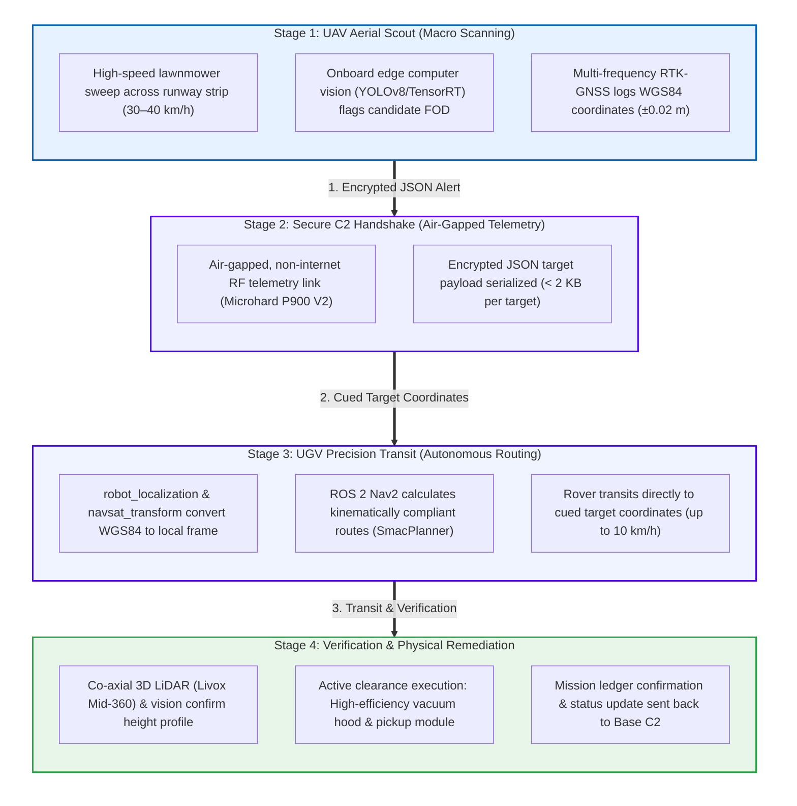
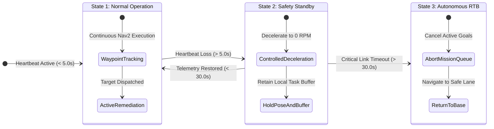

<div align="center">

# Project Runway Patrol: Inter-Agent Communication Architecture

### Heterogeneous Multi-Agent Autonomous Runway Inspection & Active FOD Remediation

**National University of Singapore (NUS) • College of Design and Engineering (CDE)**  
_Subsystem Technical Report & Documentation for CDE4301_

<br/>

[](#)
[](#)
[](#)
[-red>)](#)
[](#)

<br/>

<table align="center" width="100%">
  <tr>
    <td align="left" width="55%">
      <b>Collaborating Organizations:</b><br/>
      • <b>NUS</b>: College of Design and Engineering (Innovation & Design Programme)<br/>
      • <b>RSAF</b>: Republic of Singapore Air Force<br/>
      • <b>RAiD</b>: Robotics & Autonomous Systems Innovation and Development
    </td>
    <td align="left" width="45%">
      <b>Author & Subsystem Ownership:</b><br/>
      • <b>Lead Author:</b> Hilbert Soh<br/>
      • <b>Subsystem Scope:</b> Drone-Guided Autonomous Navigation & Multi-Agent C2 Link
    </td>
  </tr>
</table>

</div>

---

## Table of Contents

1. [System Architecture & Multi-Agent Operational Flow](#1-system-architecture--multi-agent-operational-flow)
2. [Operational & Environmental Constraints](#2-operational--environmental-constraints)
3. [Inter-Agent Telemetry & Waypoint Data Protocol](#3-inter-agent-telemetry--waypoint-data-protocol)
4. [Comparative Evaluation of Wireless Data Links](#4-comparative-evaluation-of-wireless-data-links)
5. [Hardware Selection & Technical Justification: Microhard P900 V2](#5-hardware-selection--technical-justification-microhard-p900-v2)
6. [Singapore RF Regulatory Compliance (IMDA TS SRD)](#6-regulatory-compliance-singapore-imda-ts-srd)
7. [ROS 2 Middleware & Software Bridge Architecture](#7-ros-2-middleware--software-bridge-architecture)
8. [Phased Implementation & Validation Roadmap](#8-phased-implementation--validation-roadmap)
9. [Fail-Safe Program](#9-fail-safe-program)
10. [References (APA 7th Edition)](#10-references-apa-7th-edition)

---

## 1. System Architecture & Multi-Agent Operational Flow



### 1.1 Detailed Operational Flow Breakdown

- **Stage 1: UAV Aerial Scout (Macro Scanning)**
  - **Sweep Pattern & Velocity:** Executes high-speed lawnmower sweeps across the $5\text{ km} \times 60\text{ m}$ runway strip at $30\text{--}40\text{ km/h}$.
  - **Edge Machine Vision:** Onboard companion computer runs edge vision models (YOLOv8 / TensorRT) to flag candidate FOD and pavement defects.
  - **RTK-GNSS Georeferencing:** Multi-frequency RTK-GNSS logs high-precision WGS84 coordinates ($\pm 0.02\text{ m}$ accuracy) with zero ground footprint during the sweep phase.

- **Stage 2: Secure C2 Handshake (Air-Gapped Telemetry)**
  - **RF Telemetry Link:** Transmits across an air-gapped, non-internet RF link (Microhard P900 V2).
  - **Target Alert Payload:** Serializes encrypted JSON metadata packets ($< 2\text{ KB}$ per target) containing WGS84 coordinates, threat class, and confidence scores.

- **Stage 3: UGV Precision Transit (Autonomous Routing)**
  - **Coordinate Transformation:** `robot_localization` and `navsat_transform_node` convert global WGS84 coordinates into the local metric map frame (`odom` $\rightarrow$ `base_link`).
  - **Nav2 Path Planning:** The ROS 2 Nav2 stack computes kinematically compliant ground trajectories using `SmacPlannerHybrid`.
  - **Precision Transit:** The UGV transits directly to cued target coordinates at operational speeds up to $10\text{ km/h}$.

- **Stage 4: Verification & Debris Remediation**
  - **Multi-Modal Verification:** Co-axial 3D LiDAR (Livox Mid-360) and RGB camera confirm the local physical height profile and target location.
  - **Physical Clearance Execution:** Active clearance modules engage, utilizing a high-efficiency vacuum hood and localized pickup module.
  - **Mission Ledger Confirmation:** Status ledger update (`COLLECTED` / `VERIFIED`) is transmitted back to the Base Station C2.

---

## 2. Operational & Environmental Constraints

Operating autonomous robotic systems within active military airbases and civil airport flight lines introduces four mandatory baseline requirements:

| Requirement Parameter               | Operational Specification                                             | Engineering Justification                                                                   |
| ----------------------------------- | --------------------------------------------------------------------- | ------------------------------------------------------------------------------------------- |
| **Wireless Mobility**               | Fully untethered peer-to-peer telemetry link                          | Allows continuous, independent motion between aerial and surface platforms.                 |
| **Long Operational Range**          | Multi-kilometer line-of-sight coverage ($1\text{--}4\text{ km}$)      | Must cover the full span of an active runway, blast pads, and adjoining taxiways.           |
| **Non-Internet / Air-Gapped**       | Zero dependence on commercial cellular modems, public clouds, or ISPs | Enforces military operational security; mitigates electronic warfare and IP spoofing risks. |
| **Outdoor Environmental Hardening** | Operational across tropical downpours and hot tarmac surfaces         | Withstands severe RF multipath reflections from asphalt and tarmac heat shimmer.            |

---

## 3. Inter-Agent Telemetry & Waypoint Data Protocol

Continuously streaming uncompressed raw video across long-distance RF channels exhausts wireless link budgets, introduces high latency, and drains aerial platform battery reserves. The communication architecture strictly restricts over-the-air transmissions to **asynchronous, structured telemetry packets and target waypoints**.

### 3.1 Downlink: UAV $\rightarrow$ UGV (Target C2 Alert)

When candidate debris is flagged by edge computer vision models running on the UAV companion computer, it serializes a georeferenced JSON metadata payload:

```json
{
  "mission_id": "RUNWAY_PATROL_2026_09_15",
  "timestamp_utc": "2026-09-15T05:50:24.120Z",
  "source_agent_id": "UAV_ALPHA_01",
  "threat_id": "FOD_TARGET_088",
  "georeference": {
    "latitude": 1.3592114,
    "longitude": 103.9893128,
    "altitude_msl_m": 0.15,
    "rtk_status": "FIXED",
    "horizontal_uncertainty_m": 0.02
  },
  "anomaly_metadata": {
    "primary_class": "metallic_hardware",
    "sub_class": "aircraft_bolt",
    "confidence_score": 0.93,
    "estimated_size_cm": 3.8
  },
  "priority_level": "HIGH_ACTIVE_REMEDIATION",
  "cryptographic_signature": "b94d27b9934d3e08a52e52d7da7dabfac484efe37a5380ee9088f7ace2efcde9"
}
```

- **Global Georeference:** High-precision WGS84 coordinates paired with RTK fix quality indicators (`FIXED`, $\pm 0.02\text{ m}$).
- **Threat Classification:** Dictates payload routing and remediation action (e.g., vacuum suction power and localized clearance module settings).
- **Operational Priority:** Guides the UGV's dynamic queue optimizer to either preempt active goals for critical centerline debris or append targets to a monotonic sweep.

### 3.2 Uplink: UGV $\rightarrow$ UAV / Base Station C2 (State & Task Ledger)

To close the Command-and-Control (C2) feedback loop, the UGV serializes and transmits a bi-directional telemetry packet (`ugv_state_telemetry.json`) back to the Base Station / UAV over the P900 RF link:

```json
{
  "mission_id": "RUNWAY_PATROL_2026_09_15",
  "timestamp_utc": "2026-09-15T05:50:26.450Z",
  "source_agent_id": "UGV_ROVER_01",
  "target_ack": {
    "threat_id": "FOD_TARGET_088",
    "task_state": "EN_ROUTE",
    "distance_to_target_m": 14.8,
    "eta_seconds": 6.2
  },
  "vehicle_telemetry": {
    "pose_wgs84": {
      "latitude": 1.359195,
      "longitude": 103.98929,
      "heading_deg": 42.5
    },
    "battery_state_pct": 88.4,
    "battery_voltage_v": 24.8,
    "vacuum_hood_status": "READY_STANDBY",
    "operational_mode": "AUTONOMOUS_NAV2"
  },
  "link_watchdog": {
    "heartbeat_sequence": 1402,
    "rssi_dbm": -68
  },
  "cryptographic_signature": "e3b0c44298fc1c149afbf4c8996fb92427ae41e4649b934ca495991b7852b855"
}
```

- **Task Ledger Handshake (`target_ack`):** Real-time status update (`ACKNOWLEDGED`, `EN_ROUTE`, `VERIFIED`, `COLLECTED`, or `FALSE_ALARM`) providing deterministic tracking of target clearance progression.
- **Vehicle State Feedback (`vehicle_telemetry`):** Live WGS84 coordinates, orientation heading, main battery bus health ($24.8\text{ V}$), clearance sub-system readiness, and active Nav2 operating mode.
- **Link Watchdog & Heartbeat (`link_watchdog`):** Monotonic sequence counter and received signal strength indicator ($\text{RSSI} = -68\text{ dBm}$) enabling continuous link loss watchdog evaluation.

---

## 4. Comparative Evaluation of Wireless Data Links

Table 4.1 benchmarks potential wireless transmission technologies against the strict operational and security constraints of active airfield environments.

| Technology Category                                | Frequency / Standard                          | Operational Range                    | Over-the-Air Bandwidth                | Airside Security & Compliance                                | System Complexity & Power                                  | Selection Status |
| :------------------------------------------------- | :-------------------------------------------- | :----------------------------------- | :------------------------------------ | :----------------------------------------------------------- | :--------------------------------------------------------- | :--------------- |
| **Serial RF Telemetry (Microhard P900 V2)**        | 917–925 MHz FHSS (Singapore SRD)              | 🟩 Excellent (> 5 km Line-of-Sight)  | 115.2 – 276 kbps (Telemetry & Alerts) | 🟩 Air-gapped, AES-256, IMDA compliant ($\le 100\text{ mW}$) | 🟩 Minimal power (< 2.5 W), Direct USB/UART node           | **SELECTED**     |
| **Broadband IP Bridge (Microhard pMDDL2450/2550)** | 2.4 GHz / 2.5 GHz / 5.8 GHz OFDM Broadband IP | 🟨 Moderate (1 – 3 km Line-of-Sight) | 25 Mbps (Full HD Stream Capable)      | 🟩 Air-gapped, Ethernet AES-256                              | ⚠️ High cost, requires MIMO antennas & industrial switches | **EVALUATED**    |
| **Commercial Cellular (4G LTE / 5G Public)**       | 700 MHz – 3.5 GHz Mobile Networks             | 🟩 Unlimited (Cell tower coverage)   | 50 – 300 Mbps                         | ❌ Non-compliant for military airbase C2 link                | ⚠️ Dependent on public commercial ISP infrastructure       | **REJECTED**     |
| **Standard Industrial Wi-Fi (802.11ac)**           | 2.4 GHz / 5 GHz Unlicensed Wi-Fi              | ❌ Poor (< 80 m outdoor asphalt)     | 100 – 433 Mbps                        | 🟨 WPA3 Enterprise, severe multipath tarmac fading           | 🟩 Low cost, benchtop simulation standard                  | **PHASE 1 ONLY** |

---

## 5. Hardware Selection & Technical Justification: Microhard P900 V2

The **Microhard P900 V2** serial RF telemetry module was selected over high-throughput broadband IP bridges (e.g., pMDDL2450/2550) based on payload requirements, power constraints, hardware integration cost, and RF propagation characteristics.

<div style="display: flex; gap: 20px; flex-wrap: wrap; margin: 24px 0;">

  <!-- P900 CARD (SELECTED) -->
  <div style="flex: 1; min-width: 280px; border: 2px solid #4c00fd; border-radius: 10px; padding: 20px; background-color: #ffffff; text-align: center; box-shadow: 0 4px 12px rgba(76, 0, 253, 0.08);">
    <span style="background-color: #4c00fd; color: #ffffff; font-size: 0.75em; padding: 4px 12px; border-radius: 12px; font-weight: bold; letter-spacing: 0.5px;">SELECTED HARDWARE C2 LINK</span>
    <h3 style="margin: 12px 0 6px 0; color: #1a1a1a; font-size: 1.2em;">Microhard P900 V2</h3>
    <p style="color: #586069; font-size: 0.85em; margin-top: 0; margin-bottom: 16px;">
      Long-Range 900 MHz Frequency Hopping Spread Spectrum (FHSS) Serial Data Module
    </p>
    <div style="background-color: #f8f9fa; border: 1px solid #eaeaea; border-radius: 8px; padding: 12px; margin-bottom: 16px;">
      
    </div>
    <ul style="text-align: left; font-size: 0.88em; color: #333333; line-height: 1.5; padding-left: 20px; margin: 0;">
      <li><strong>Operating Frequency:</strong> 917–925 MHz (IMDA TS SRD Singapore Compliant)</li>
      <li><strong>RF Power &amp; Sensitivity:</strong> Up to 1W (+30 dBm) / Sensitivity: -116 dBm</li>
      <li><strong>Data Protocol:</strong> Point-to-Point / Point-to-Multipoint Encrypted Serial UART</li>
      <li><strong>Line-of-Sight Range:</strong> Exceeds 5 km across open pavement</li>
    </ul>
  </div>

  <!-- pMDDL2550 CARD (EVALUATED ALTERNATE) -->
  <div style="flex: 1; min-width: 280px; border: 1px solid #d0d7de; border-radius: 10px; padding: 20px; background-color: #fafbfc; text-align: center;">
    <span style="background-color: #6c757d; color: #ffffff; font-size: 0.75em; padding: 4px 12px; border-radius: 12px; font-weight: bold; letter-spacing: 0.5px;">EVALUATED BROADBAND ALTERNATE</span>
    <h3 style="margin: 12px 0 6px 0; color: #1a1a1a; font-size: 1.2em;">Microhard pMDDL2550</h3>
    <p style="color: #586069; font-size: 0.85em; margin-top: 0; margin-bottom: 16px;">
      High-Throughput 2.4 GHz / 5.8 GHz Dual-Antenna Broadband IP Ethernet Bridge
    </p>
    <div style="background-color: #ffffff; border: 1px solid #eaeaea; border-radius: 8px; padding: 12px; margin-bottom: 16px;">
      
    </div>
    <ul style="text-align: left; font-size: 0.88em; color: #555555; line-height: 1.5; padding-left: 20px; margin: 0;">
      <li><strong>Operating Bandwidth:</strong> Up to 25 Mbps broadband IP data rate</li>
      <li><strong>System Overhead:</strong> Requires multi-port Ethernet switch &amp; dual MIMO antennas</li>
      <li><strong>RF Attenuation:</strong> Higher 2.4/5.8 GHz signal absorption over wet asphalt</li>
      <li><strong>Cost &amp; Power:</strong> ~4× unit cost and higher thermal/electrical footprint</li>
    </ul>
  </div>

</div>

### 5.1 Bandwidth Sizing & Latency Analysis

Because computer vision inference runs locally on the UAV companion computer, high-bandwidth uncompressed sensor streaming across the wireless datalink is eliminated. Transmission is limited to compact C2 alerts ($0.5\text{--}1.5\text{ KB}$):

$$\text{Transmission Time} = \frac{\text{Payload Size}}{\text{Data Rate}} = \frac{1.5\text{ KB} \times 8\text{ bits/byte}}{115.2\text{ kbps}} \approx 104\text{ ms}$$

At standard asynchronous serial baud rates of **$115.2\text{ kbps}$ or $230.4\text{ kbps}$**, transmitting an alert packet completes in **$\approx 50\text{--}100\text{ ms}$**. Because anomaly handoffs occur asynchronously as discrete events, the P900’s over-the-air link rate (up to $276\text{ kbps}$) provides ample bandwidth headroom without introducing dispatch lag.

### 5.2 Cost, Power, and Integration Justification

Deploying broadband data links such as the pMDDL2450/2550 ($>20\text{ Mbps}$) incurs substantial capital cost and requires multi-port industrial Ethernet switches, $12\text{V}$ isolated DC–DC buck converters, and dual-antenna $2\times 2\text{ MIMO}$ spatial separation on the chassis. The P900 V2 integrates directly via USB/UART (`/dev/ttyUSB0`), draws significantly less electrical power, and delivers robust line-of-sight propagation exceeding $5\text{ km}$ across open asphalt.

---

## 6. Regulatory Compliance (Singapore IMDA TS SRD)

Operating radio transceivers in Singapore requires strict compliance with statutory regulations enforced by the **Infocomm Media Development Authority (IMDA)** and airside spectrum management policies:

- **Frequency Band Allocation:** Default P900 firmware hops across United States FCC ISM (902–928 MHz). In Singapore, IMDA TS SRD restricts unlicensed operation strictly to **917–925 MHz**.
- **Interference Mitigation:** Frequencies below 917 MHz overlap with licensed commercial cellular mobile networks. Operating unmodified US-market transceivers causes illegal out-of-band interference and violates the _Telecommunications Act 1999_.
- **Firmware Configuration & Power Throttling:** Frequency-hopping tables are software-locked via AT commands to the authorized **917–925 MHz sub-band**, and RF output power is throttled to ensure equivalent isotropically radiated power does not exceed the statutory cap of **$\le 100\text{ mW}$ ($+20\text{ dBm}$) EIRP**.

---

## 7. ROS 2 Middleware & Software Bridge Architecture

To maintain high operational security and zero latency, the system utilizes a **two-layer communications architecture** separating inter-agent long-range RF links from intra-agent local middleware:

```mermaid
flowchart LR
    subgraph UAV ["Airborne Platform (UAV)"]
        U1["UAV Edge Detector"] -->|JSON Target Telemetry| U2["uav_serial_bridge_node"]
        U2 -->|Writes /dev/ttyUSB0| P1["Microhard P900 V2 (Airborne)"]
    end

    P1 ===>|917–925 MHz FHSS RF Link| P2["Microhard P900 V2 (Ground)"]

    subgraph UGV ["Ground Platform (UGV)"]
        P2 -->|Reads /dev/ttyUSB0| G1["ugv_c2_receiver_node"]
        G1 -->|geometry_msgs/PoseStamped| G2["ROS 2 Nav2 Waypoint Pipeline"]
    end

    style UAV fill:#e6f2ff,stroke:#0066cc,stroke-width:2px
    style UGV fill:#e8f5e9,stroke:#28a745,stroke-width:2px
    style P1 fill:#eef0ff,stroke:#4c00fd
    style P2 fill:#eef0ff,stroke:#4c00fd
```



### 7.1 Architectural Decoupling: Serial C2 RF Link vs. Intra-Vehicle DDS

Because the Microhard P900 V2 operates as a point-to-point character serial transceiver (`/dev/ttyUSB0` / UART) rather than a Layer 2 Ethernet bridge, native ROS 2 Data Distribution Service (DDS) discovery cannot run directly across the physical radio link without Point-to-Point Protocol (`pppd`) daemon encapsulation—which incurs heavy header overhead, IP fragmentation, and unacceptable latency.

The system decouples the communication layers as follows:

1. **Inter-Agent Long-Range Air Link (UAV $\leftrightarrow$ UGV):** Relies on custom lightweight ROS 2 Python serial bridge nodes (`uav_serial_bridge_node` and `ugv_c2_receiver_node`) communicating over `/dev/ttyUSB0` via `pyserial`. Encrypted JSON target alerts and telemetry packets appended with CRC-16 checksums are serialized directly into serial byte streams.
2. **Intra-Vehicle Local Middleware:** Onboard each vehicle (e.g., within the UGV linking the Jetson Orin Nano, Livox Mid-360 LiDAR, microcontrollers, and Nav2 nodes), standard ROS 2 DDS operates over local loopback (`127.0.0.1`) and high-speed onboard Ethernet (`eth0`).

> [!NOTE]
> **Phase 1 Interim Benchtop Configuration (Wi-Fi Simulation):** During early simulation and benchtop development (Phase 1), when two PCs run on a private local Wi-Fi router subnet (`192.168.1.0/24`), CycloneDDS is used with explicit unicast peer discovery (`cyclonedds.xml`) to validate ROS 2 topic dispatch before hardware serial migration:

```xml
<?xml version="1.0" encoding="UTF-8" ?>
<!-- Phase 1 Benchtop Interim Configuration (Local Network Multi-PC Simulation) -->
<CycloneDDS xmlns="https://cdds.io/config">
    <Domain id="any">
        <General>
            <NetworkInterfaceAddress>wlan0</NetworkInterfaceAddress>
        </General>
        <Discovery>
            <Peers>
                <!-- Simulated UAV Transmitter PC -->
                <Peer address="192.168.1.10"/>
                <!-- Simulated UGV Receiver PC -->
                <Peer address="192.168.1.20"/>
            </Peers>
            <ParticipantIndex>auto</ParticipantIndex>
        </Discovery>
    </Domain>
</CycloneDDS>
```

### 7.2 Coordinate Frame Transformation & Nav2 Integration Pipeline

Global geodetic coordinates received from the UAV must be systematically transformed into local metric frames for ground navigation:

$$\text{WGS84 (Lat, Lon, Alt)} \xrightarrow{\text{navsat\_transform\_node}} \text{Metric Goal Pose } (X, Y)_{\text{map}} \xrightarrow{\text{Nav2 Planner}} \text{Trajectory Tracking } (\text{odom} \rightarrow \text{base\_link})$$

1. **Geodetic Goal Conversion (`navsat_transform_node`):** When the `ugv_c2_receiver_node` receives a WGS84 target alert from the UAV over serial, `navsat_transform_node` ingests the geodetic coordinates and converts them into a metric `geometry_msgs/msg/PoseStamped` in the global ENU frame (`map`). This pose is dispatched directly to Nav2's `planner_server` (`SmacPlannerHybrid`) as a target goal pose.
2. **Global Coordinate Frame (`map` $\rightarrow$ `odom`):** The global instance of `robot_localization` (`ekf_node_global`) fuses continuous wheel odometry, 9-DOF IMU data, and RTK-GNSS fixes to estimate global metric position and publish the dynamic `map` $\rightarrow$ `odom` coordinate frame transform.
3. **Local Coordinate Frame (`odom` $\rightarrow$ `base_link`):** The local instance of `robot_localization` (`ekf_node_local`) fuses high-frequency wheel encoder odometry ($\sim 50\text{ Hz}$) and IMU angular rates ($100\text{ Hz}$) to compute and broadcast smooth `odom` $\rightarrow$ `base_link` transforms, ensuring drift-free local costmap evaluation, obstacle avoidance, and velocity controller (`cmd_vel`) execution.

---

## 8. Phased Implementation & Validation Roadmap

To mitigate development risks and validate communications before field deployment, the project employs a two-phase implementation roadmap:

```mermaid
flowchart LR
    subgraph Phase1 ["Phase 1: Interim (Virtual Simulation & Multi-PC Benchtop)"]
        direction TB
        P1A["Transmitter PC (UAV Sim): External mock generator serializes target JSON alerts"]
        P1B["Receiver PC (UGV Sim): Gazebo digital twin, local costmaps & Nav2 stack"]
        P1C["Network: Private Wi-Fi Router Subnet (192.168.1.0/24) with CycloneDDS unicast"]
        P1D["Objective: Validate serialization, navsat_transform_node & Nav2 paths"]
    end

    Phase1 ==>|Hardware-in-the-Loop HIL Migration| Phase2

    subgraph Phase2 ["Phase 2: Outdoor Deployment (Physical Hardware Integration)"]
        direction TB
        P2A["Airborne Transmitter: NVIDIA Jetson + YOLOv8 + Microhard P900 V2"]
        P2B["Physical UGV: 4WD chassis + Livox Mid-360 LiDAR + Clearance Modules"]
        P2C["Long-Range RF Link: Microhard P900 V2 (917–925 MHz, <= 100 mW EIRP)"]
        P2D["Objective: Outdoor pavement tracking & active physical debris extraction"]
    end

    style Phase1 fill:#e6f2ff,stroke:#0066cc,stroke-width:2px
    style Phase2 fill:#eef0ff,stroke:#4c00fd,stroke-width:2px
```



### 8.1 Phase 1: Interim (Virtual Simulation & Multi-Machine Benchtop)

- **Multi-PC Benchtop:** One PC simulates the UAV scout (generating mock FOD alerts), while a second PC hosts the UGV's Gazebo simulation environment and Nav2 stack.
- **Network Baseline:** Both machines operate on a private subnet (`192.168.1.0/24`) using static IP addresses (`192.168.1.10` and `192.168.1.20`) and CycloneDDS unicast peer discovery.
- **Navigation Verification:** Target alerts are parsed into local Cartesian coordinates. Nav2’s `SmacPlannerHybrid` plans paths respecting minimum turning radius constraints ($R_{\text{min}} \ge 1.0\text{ m}$), while the `RegulatedPurePursuitController` guides the rover without breaching simulated costmap boundaries.

### 8.2 Phase 2: Outdoor Deployment (Physical Hardware Integration)

- **Embedded Migration:** Verified software stacks are transferred to the onboard NVIDIA Jetson computer.
- **Physical RF Telemetry Link:** The local Wi-Fi router is removed. The system transitions to the Microhard P900 V2 configured for Singapore's 917–925 MHz band.
- **Full-System Field Validation:** The physical UGV ingests live coordinate dispatches over the air, navigates outdoor asphalt, avoids dynamic obstacles via 3D LiDAR, and activates active clearance mechanisms.

---

## 9. Fail-Safe Program

Airside safety mandates deterministic robot behavior if telemetry drops or hostile interference is detected:



- **Heartbeat Timeout ($>5.0\text{ s}$):** If the UGV stops receiving keep-alive pulses from the C2 datalink, it executes a controlled deceleration to $0\text{ RPM}$ and enters a safe standby mode.
- **Autonomous Task Buffering:** Waypoint coordinates buffered prior to link drop remain in local memory, allowing the rover to complete scheduled clearances even during brief RF shadowing.
- **Critical Link Timeout ($>30\text{ s}$):** If link interruption persists beyond $30\text{ s}$, the UGV aborts its active mission and executes an autonomous Return-to-Base (RTB) to an airside staging area.
- **Cybersecurity Hardening:** Payloads utilize AES-256 symmetric encryption and Frequency Hopping Spread Spectrum (FHSS) modulation. Cryptographic signatures ensure unauthorized or spoofed commands are rejected before reaching the Nav2 goal server.

---

## 10. References (APA 7th Edition)

- ASTM International. (2020). _Standard test method for airport pavement condition index surveys_ (ASTM D5340-20). ASTM International. [https://doi.org/10.1520/D5340-20](https://doi.org/10.1520/D5340-20)
- Federal Aviation Administration. (2014). _Airport foreign object debris (FOD) management equipment_ (FAA Advisory Circular AC 150/5220-24). U.S. Department of Transportation. [https://www.faa.gov/airports/resources/advisory_circulars/index.cfm/go/document.current/documentNumber/150_5220-24](https://www.faa.gov/airports/resources/advisory_circulars/index.cfm/go/document.current/documentNumber/150_5220-24)
- Infocomm Media Development Authority. (2021). _Technical specification for short range devices_ (IMDA TS SRD Issue 1 Revision 2). Standards Department, Infocomm Media Development Authority of Singapore. [https://www.imda.gov.sg/assets/340548ab-3e43-436b-acc0-6148d95f3d0f.pdf](https://www.imda.gov.sg/assets/340548ab-3e43-436b-acc0-6148d95f3d0f.pdf)
- Infocomm Media Development Authority. (2023). _Annex B: Addendum/corrigendum to IMDA TS SRD (Issue 1 Revision 2)_. Infocomm Media Development Authority of Singapore. [https://www.imda.gov.sg/regulations-and-licensing-listing/dealer-and-equipment-registration-framework/equipment-registration-framework](https://www.imda.gov.sg/regulations-and-licensing-listing/dealer-and-equipment-registration-framework/equipment-registration-framework)
- International Civil Aviation Organization. (2018). _Handbook on radio frequency spectrum requirements for civil aviation including statement of approved ICAO policies_ (Doc 9718, Vol. 1, 2nd ed.). International Civil Aviation Organization. [https://www.icao.int/safety/airnavigation/OPS/Doc9718/Pages/default.aspx](https://www.icao.int/safety/airnavigation/OPS/Doc9718/Pages/default.aspx)
- Kim, S., Paes, D., Lee, K., Irizarry, J., & Johnson, E. N. (2019). UAS-based airport maintenance inspections: Lessons learned from pilot study implementation. In _Computing in Civil Engineering 2019_ (pp. 382–389). American Society of Civil Engineers. [https://doi.org/10.1061/9780784482445.049](https://doi.org/10.1061/9780784482445.049)
- Krestenitis, M., Petropoulos, A., Koulalis, I., Stipanovic, I., Skaric Palic, S., Ioannidis, K., & Vrochidis, S. (2026). Digitalization and automation of runway inspection using unmanned aerial vehicles. _Sensors_, 26(4), Article 1100. [https://doi.org/10.3390/s26041100](https://doi.org/10.3390/s26041100)
- Macenski, S., Foote, T., Gerkey, B., Lalancette, C., & Woodall, W. (2022). Robot Operating System 2: Design, architecture, and uses in the wild. _Science Robotics_, 7(66), Article eabm6074. [https://doi.org/10.1126/scirobotics.abm6074](https://doi.org/10.1126/scirobotics.abm6074)
- Macenski, S., Martín, F., White, R., & Clavero, J. (2020). The Marathon 2: A navigation system. In _2020 IEEE/RSJ International Conference on Intelligent Robots and Systems (IROS)_ (pp. 2718–2725). IEEE. [https://doi.org/10.1109/IROS45743.2020.9341207](https://doi.org/10.1109/IROS45743.2020.9341207)
- Moore, T., & Stouch, D. (2014). A generalized extended Kalman filter implementation for the Robot Operating System. In S. Carpin, R. Verschure, & A. Birk (Eds.), _Intelligent autonomous systems 13_ (Advances in Intelligent Systems and Computing, Vol. 302, pp. 335–348). Springer. [https://doi.org/10.1007/978-3-319-08338-4_25](https://doi.org/10.1007/978-3-319-08338-4_25)
- Munyer, T., Brinkman, D., Zhong, X., Huang, C., & Konstantzos, I. (2022). Foreign object debris detection for airport pavement images based on self-supervised localization and vision transformer. In _2022 International Conference on Computational Science and Computational Intelligence (CSCI)_ (pp. 1388–1394). IEEE. [https://doi.org/10.1109/CSCI58124.2022.00248](https://doi.org/10.1109/CSCI58124.2022.00248)
- Republic of Singapore. (1999). _Telecommunications Act 1999_ (Cap. 323, 2020 Rev. Ed.). Singapore Statutes Online. [https://sso.agc.gov.sg/Act/TA1999](https://sso.agc.gov.sg/Act/TA1999)
- Shan, J., Miccinesi, L., Beni, A., Pagnini, L., Cioncolini, A., & Pieraccini, M. (2025). A review of foreign object debris detection on airport runways: Sensors and algorithms. _Remote Sensing_, 17(2), Article 225. [https://doi.org/10.3390/rs17020225](https://doi.org/10.3390/rs17020225)
