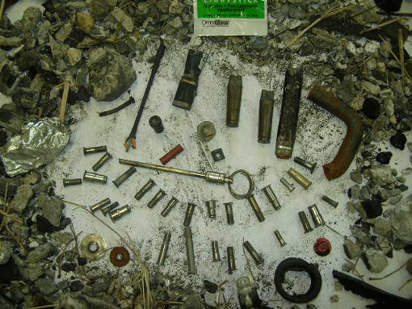
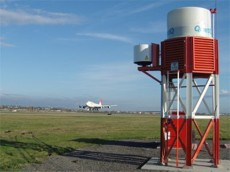
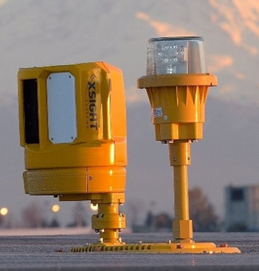
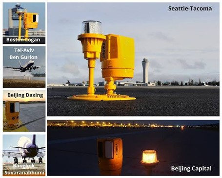
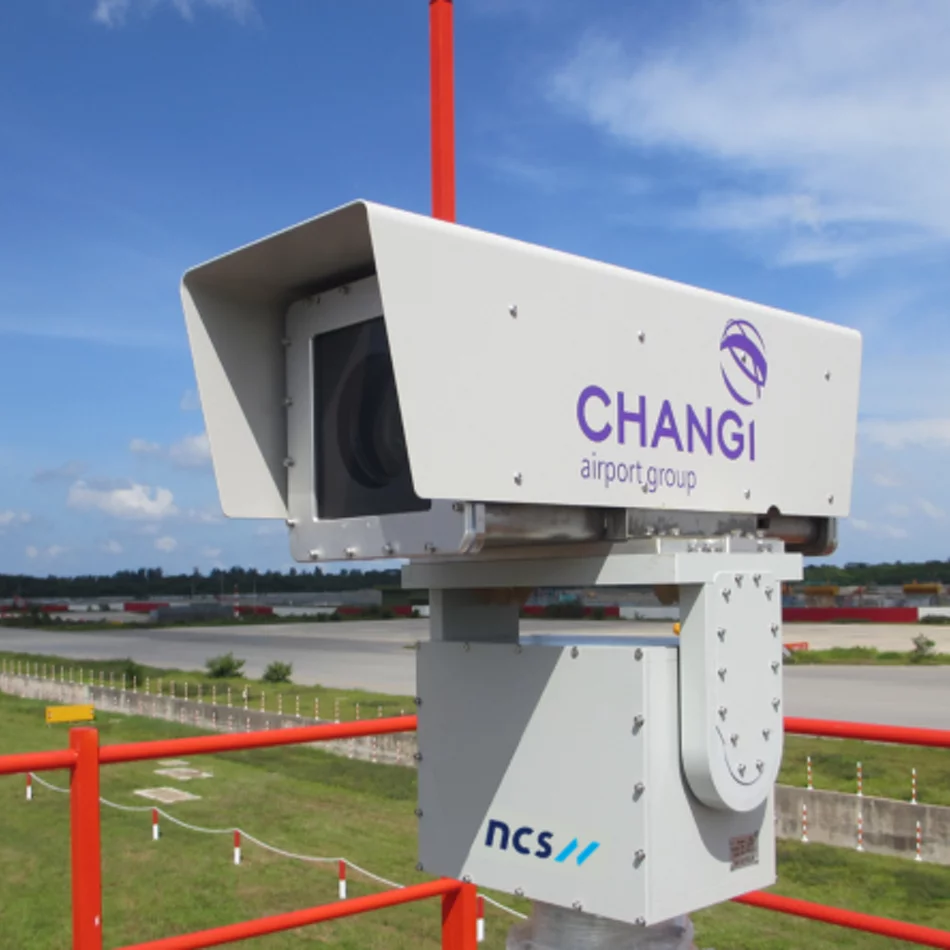
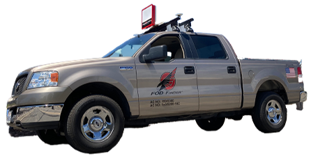
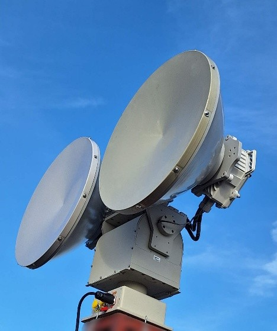
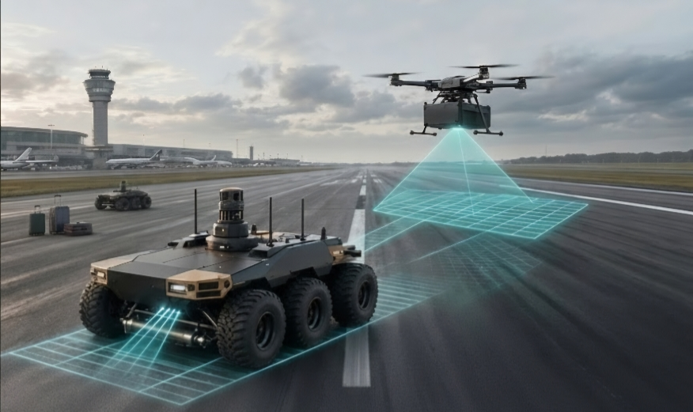

<!-- NUS LOGO DISPLAY -->

# Autonomous Runway Inspection & Active FOD Remediation Robot

### Draft Report for CDE 4301

_In Collaboration with the Republic of Singapore Air Force (RSAF) and Robotics & Autonomous Systems Innovation and Development (RAiD)_  
_Innovation & Design Programme | College of Design and Engineering | National University of Singapore_

---

### Project Details

_Table 0.1: Project Team and Faculty Supervision Details_
| Project Team (UGV Focus) | Student ID | Supervision & Faculty |
| :--- | :--- | :--- |
| **Hilbert Soh** | `A0308263H` | **Dr Tang Kok Zuea** |
| **Asuka** | `A0308285Y` | Innovation & Design Programme |
| **Gabriel Tan** | `A0308452H` | College of Design and Engineering |
| **Zacarias Ng** | `A0306899H` | National University of Singapore |
| **Bryan Ng** | `[add ID]` | |

---

## Table of Contents

1. [Introduction](#1-introduction)
2. [Problem Statement & Operational Rationale](#2-problem-statement--operational-rationale)
3. [Existing Systems & Commercial Overview](#3-existing-systems--commercial-overview)
   - [3.1 The 4 Main Automated Detection Categories](#31-the-4-main-automated-detection-categories)
   - [3.2 Technical Breakdown by Sensing Category](#32-technical-breakdown-by-sensing-category)
   - [3.3 Commercial FOD System Benchmark](#33-commercial-fod-system-benchmark)
   - [3.4 Analysis of Existing Airside UGV Solutions](#34-analysis-of-existing-airside-ugv-solutions)
4. [Multi-Agent System Architecture & Rationale (UAV + UGV)](#4-multi-agent-system-architecture--rationale-uav--ugv)
5. [Robot Roles & Mission Operational Workflow](#5-robot-roles--mission-operational-workflow)
6. [Classification of Foreign Object Debris (FOD) & Surface Defects](#6-classification-of-foreign-object-debris-fod--surface-defects)
7. [UGV Design Specifications & Operational Features](#7-ugv-design-specifications--operational-features)
8. [UGV Sensor Suite & Mobile Hybrid Architecture](#8-ugv-sensor-suite--mobile-hybrid-architecture)
9. [Key Technical Improvements for Our UGV Platform](#9-key-technical-improvements-for-our-ugv-platform)
10. [Individual Scope](#10-individual-scope)
    - [10.1 Hilbert Soh: Drone-Guided Autonomous Navigation and Obstacle Avoidance](#101-hilbert-soh-drone-guided-autonomous-navigation-and-obstacle-avoidance)
    - [10.2 Asuka: [Scope Title]](#102-asuka-scope-title)
    - [10.3 Gabriel Tan: [Scope Title]](#103-gabriel-tan-scope-title)
    - [10.4 Zacarias Ng: [Scope Title]](#104-zacarias-ng-scope-title)
    - [10.5 Bryan Ng: [Scope Title]](#105-bryan-ng-scope-title)
11. [References](#11-references)

---

## 1. Introduction

Airfield operational readiness depends heavily on maintaining pristine, hazard-free runway surfaces. Foreign Object Debris (FOD)—encompassing metallic jet engine fasteners, asphalt spalls, maintenance tool components, and tire rubber fragments—poses a constant risk to military fighter jets and commercial transport aircraft. The ingestion of small debris into turbofan intakes or high-speed tire blowouts during takeoff roll can result in structural airframe destruction, engine failure, or catastrophic loss of life.

  
  
<em>Figure 1.1: Typical Foreign Object Debris (FOD) items found on operational runways, demonstrating the scale and variety of physical hazards.</em>

Traditional manual sweeps ("FOD walks") or manned vehicle patrols are inherently slow, labor-intensive, subject to human operator fatigue, and require extended runway closures that directly restrict operational sortie generation. While commercial stationary camera towers (such as iFerret™ 2.0) provide automated visual alerts, they require significant capital infrastructure investment and lack physical remediation capabilities.

Project **Runway Patrol** introduces a **Heterogeneous Multi-Agent Autonomous Architecture (UAV + UGV)** engineered for rapid airfield inspection and target hazard remediation at large operational airbases and commercial airports, such as Singapore Changi Airport Terminal 5 (5 km length × 60 m width). Developed under CDE 4301 at the National University of Singapore (NUS) in collaboration with defense and technical partners (**RSAF** and **RAiD**), this system pairs an Unmanned Aerial Vehicle (UAV) with an Unmanned Ground Vehicle (UGV).

While the overall project establishes a collaborative framework between two sub-teams, this report focuses specifically on the engineering, system architecture, sensor payloads, and control algorithms of the **UGV ground platform**.

---

## 2. Problem Statement & Operational Rationale

Foreign Object Debris (FOD) on airport movement areas such as runways, taxiways, aprons, and gate areas poses severe structural, operational, and safety risks to commercial and military aircraft. FOD items range from loose hardware (nuts, bolts, safety wires) and pavement fragments to tools, tire rubber, and luggage components. When ingested into jet engines or struck by aircraft tires at high speeds, FOD can cause catastrophic engine failure, tire blowouts, rejected takeoffs, or structural airframe damage.

Beyond immediate safety threats, the economic impact on the global aviation industry is substantial. Direct damage repairs, flight delays, diversions, schedule disruptions, fuel burn during ground holds, and lost revenue collectively cost the commercial aviation sector billions of dollars annually.

Current military and commercial airfield surface management protocols present three major operational bottlenecks:

1. **Excessive Runway Occupancy Time (ROT):** Traditional manual airfield inspections rely on personnel physically driving or walking along movement areas to visually scan for debris. This approach is labor-intensive, subject to human error/fatigue, and creates operational bottlenecks due to prolonged runway closures (~5 km at Changi T5).
2. **The "Detect-to-Clear" Latency Gap:** Fixed infrastructure networks (e.g., stationary tower cameras or millimeter-wave radars) can flag debris locations, but they are passive in nature. They cannot physically inspect or clear the debris, still requiring human dispatch onto active runways.
3. **Environmental & Range Limitations:** Fixed cameras degrade in rain, fog, snow, and darkness, while long-range radar face resolution limits when detecting sub-centimeter targets against ground clutter. Standalone aerial drones lack the battery capacity and structure to transport heavy physical clearance tools (high-power magnets, industrial vacuums), while standalone ground vehicles lack the high-altitude, wide field-of-view line of sight to rapidly scan multi-kilometer asphalt strips.

An autonomous Unmanned Ground Vehicle (UGV) bridges these gaps by offering close-proximity ground scanning, all-weather multi-sensor perception, spatial mobility, and active physical FOD retrieval.

---

## 3. Existing Systems & Commercial Overview

Existing runway inspection and FOD detection solutions across international commercial and military airfields fall into distinct technology categories.

### 3.1 The 4 Main Automated Detection Categories

- **Stationary Millimeter-Wave (MMW) Radar:** Fixed radar installations operating in the 71–100 GHz band that continuously scan runways to detect debris at long ranges in all weather conditions.
- **Stationary Electro-Optical (Camera-Based):** Fixed high-resolution visible-light or infrared/thermal cameras mounted along the runway that use computer vision algorithms to visually identify surface debris.
- **Hybrid Radar-Plus-Electro-Optical Fusion:** Systems combining MMW radar and electro-optical cameras to pair long-range all-weather target detection with visual identification, minimizing false alarm rates.
- **Mobile Radar Systems:** Vehicle-mounted radar units that scan airport movement areas while driving at operational speeds.

#### Performance Specifications (FAA AC 150/5220-24 Benchmark)

- **Stationary Radar:** Must detect a standard metal cylinder (38 mm diameter × 31 mm height) at a range of 1,000 m with location accuracy within 5 m.
- **Stationary Electro-Optical:** Must detect a 20 mm object at a range of 300 m under ambient lighting conditions.
- **Stationary Hybrid:** Must detect 20 mm objects across the full width of the runway.
- **Mobile Radar:** Must detect the reference metal cylinder across a 183 m × 183 m scan area while moving at speeds up to 48 km/h.

---

### 3.2 Technical Breakdown by Sensing Category

#### A. Stationary Millimeter-Wave Radar

- **Specifications:**
  - **Operating Frequency:** E-band (71–86 GHz) or W-band (92–100 GHz); 76 GHz is an FCC unlicensed band (Part 15).
  - **Wavelength:** Short wavelength of 3.0–3.9 mm enables detection of tiny targets.
  - **Range Resolution:** 5–30 cm proportional to available bandwidth.
  - **Detection Range & Accuracy:** Detects standard FAA reference target at $\ge 1,000\text{ m}$ with $\le 5\text{ m}$ position accuracy.
  - **Scanning Parameters:** Azimuth scan angle of 180–200° using motorized positioners; full runway sweep in 60–90 seconds.
  - **Deployment Geometry:** Optimal grazing angle $\approx 2^\circ$; mounted $\ge 50\text{ m}$ (125 m recommended at 8 m height) from runway centerline.
- **Features:** Safe milliwatt power emissions; all-weather penetration (fog, rain, snow, darkness); FMCW radar provides simultaneous range and velocity measurement to filter dynamic clutter (wildlife, vehicles).
- **Primary Challenges:** Distinguishing tiny FOD items from pavement ground clutter (texture, markings, splice joints); requires dynamic Clutter Map Constant False Alarm Rate (CM-CFAR) thresholding.

#### B. Stationary Electro-Optical (Camera-Based) Systems

- **Specifications:**
  - **Sensor Resolution:** Multi-megapixel sensors ($1920\times 1080+$) with telephoto optics operating at 30+ fps.
  - **Infrared Capability:** LWIR band (8–14 μm) for thermal contrast; NIR systems with active illumination for zero light pollution.
  - **Deployment:** Placed $\ge 150\text{ m}$ from centerline; typical runway requires 5–8 sensors for continuous coverage.
- **Features:** Uses CNNs, semantic segmentation, and background subtraction for pixel-level visual identification and object classification; LWIR cameras operate independent of shadows.
- **Primary Challenges:** High environmental degradation in rain, fog, and snow; visual false alarms triggered by tire marks, splice joints, and shadows; difficulty detecting objects $< 5\text{ cm} \times 5\text{ cm}$ at extended ranges.

#### C. Hybrid Radar-Plus-Electro-Optical Fusion Systems

- **Specifications:** Combined MMW radar and camera sensor hardware in a fused architecture satisfying full runway width 20 mm object detection.
- **Features:** Pairs radar's all-weather, day/night long-range detection with optical visual identification to overcome individual system drawbacks.
- **Primary Challenges:** While radar penetrates severe weather, optical feeds still experience visibility degradation, limiting visual target confirmation during heavy storms.

#### D. Mobile Radar Systems

- **Specifications:** Mounted on airfield patrol vehicles operating at speeds up to 48 km/h; scans $183\text{ m} \times 183\text{ m}$ areas.
- **Features:** Dynamic coverage across runways, taxiways, and aprons; dramatically cuts inspection time compared to walking sweeps.
- **Primary Challenges:** Intermittent monitoring leaving temporal gaps between patrol runs; requires continuous human driving.

---

### 3.3 Commercial FOD System Benchmark

_Table 3.1: Comparative Analysis of Commercial Airfield FOD Detection Systems_

| System Name                                 | Primary Technology                                      | Key Strengths                                                               | Primary Limitations                                                                  |
| :------------------------------------------ | :------------------------------------------------------ | :-------------------------------------------------------------------------- | :----------------------------------------------------------------------------------- |
| **Tarsier** _(QinetiQ)_                 | Stationary MMW Radar (E/W Band) + PTZ Camera            | • High all-weather resilience • Instant runway clearance check          | • High ground clutter sensitivity • Needs optical feed for target classification |
| **FODetect** _(Xsight Systems)_         | Runway Edge-Light Hybrid (MMW Radar + Near-IR Optics)   | • Zero runway blind spots • Built-in laser pointer guides manual pickup | • Hardware intensive deployment • Visual sensors degrade in severe weather       |
| **iFerret™ 2.0** _(NCS / CAG)_          | Stationary HD Electro-Optical Camera Arrays + AI Vision | • Zero RF interference • Superior visual object classification          | • High weather vulnerability (fog/rain) • Visual false alarms from shadows       |
| **FOD Finder Mobile** _(Trex Aviation)_ | Mobile MMW Radar (78–81 GHz) + GPS                      | • FAA mobile approved • Integrated vacuum pickup option                 | • Intermittent monitoring between sweeps • Requires continuous human driver      |
| **ELVA 1**                                  | Stationary FMCW Radar (76.5 GHz)                        | • Long range (1,000 m/unit) • Ultra-low power emission                  | • Slower 3-minute sweep cycle • Relies on PTZ add-on for verification            |

#### Detailed Commercial Breakdown

##### 1. QinetiQ Tarsier (Stationary MMW Radar)

- **Operational Principle:** Uses fixed tower-mounted millimeter-wave radar to continuously sweep active runway surfaces.
- **Key Features:** Integrated PTZ optical cameras automatically pan to radar coordinates to provide live visual verification for airside traffic controllers.
- **Primary Limitations:** Radar signals alone cannot classify debris types and remain sensitive to ground clutter from pavement joints and texture.

  
  
<em>Figure 3.1: QinetiQ Tarsier stationary millimeter-wave radar tower installed on airside infrastructure.</em>

##### 2. Xsight Systems FODetect & RunWize (Edge-Light Hybrid)

- **Operational Principle:** Surface Detection Units (SDUs) co-located directly inside runway edge-light fixtures along the pavement margin.
- **Key Features:** Built-in laser illuminator physically points to detected debris on the asphalt to guide manual retrieval crews at night.
- **Primary Limitations:** Requires dense, hardware-intensive deployment along the full runway length, raising installation and maintenance overhead.

  
  
  
<em>Figure 3.2: Xsight FODetect Surface Detection Units integrated into runway edge lights across international airfields.</em>

##### 3. NCS / Changi Airport Group iFerret™ 2.0 (Electro-Optical AI)

- **Operational Principle:** Intelligent electro-optical system utilizing high-definition visual sensor arrays paired with deep learning analytics.
- **Key Features:** Completely passive sensing with zero RF emissions, guaranteeing zero electromagnetic interference with aircraft avionics.
- **Primary Limitations:** Detection accuracy drops significantly during heavy rain, dense fog, or snowstorms, and suffers from shadow-induced false positives.

  
  
<em>Figure 3.3: iFerret™ 2.0 Electro-Optical PTZ sensor array deployed for airside surveillance.</em>

##### 4. Trex Aviation FOD Finder Mobile (Vehicle-Mounted Radar)

- **Operational Principle:** FAA-approved vehicle-mounted 78–81 GHz MMW radar scanning while driving at operational speeds up to 50 km/h with 1.5 m GPS geotagging.
- **Key Features:** Offers an optional truck-mounted vacuum collection module for single-pass detection and physical pickup.
- **Primary Limitations:** Scanning is intermittent (limited to patrol frequency) and requires continuous dedicated human drivers.

  
  
<em>Figure 3.4: Trex Aviation FOD Finder Mobile truck-mounted MMW radar inspection platform.</em>

##### 5. ELVA 1 Scanning Radar Sensor (FMCW Radar)

- **Operational Principle:** 76.5 GHz FMCW radar with a $200^\circ$ FOV covering up to 1,000 m radius per radar module.
- **Key Features:** Ultra-low RF power emissions with long-range coverage per sensor node.
- **Primary Limitations:** Takes 3 minutes for a complete double-azimuth scan, significantly slower than competing 60–90 second systems.

  
  
<em>Figure 3.5: ELVA 1 dual-dish 76 GHz scanning radar sensor unit.</em>

---

### 3.4 Analysis of Existing Airside UGV Solutions

_Table 3.2: Analysis of Existing Airside UGV Solutions_

| Solution                | Primary Detection Technologies                                                | Key Features                                                                                                                              | Limitations / Drawbacks                                                                   |
| :---------------------- | :---------------------------------------------------------------------------- | :---------------------------------------------------------------------------------------------------------------------------------------- | :---------------------------------------------------------------------------------------- |
| **Airtrek Groundwatch** | Multi-camera arrays, long-range LiDAR, Onboard Edge AI                        | • Dual wingtip deployment • Operator live view & aircraft inspection • GPS target tagging                                         | • Lacks physical FOD pick-up/collection mechanism                                         |
| **Roboxi**              | AI optical vision, multi-spectral thermal sensors, high-precision positioning | • Modular payload architecture • Bird deterrent capabilities • Airfield light bulb & pavement inspection                          | • High payload weight & elevated cost • Software complexity & shorter battery runtime |
| **Guimu Robot**         | High-frequency Ground-Penetrating Radar (GPR), 3D LiDAR, HD cameras           | • Deep sub-surface structural mapping (voids, moisture) • Covers $7,500\text{ m}^2/\text{hr}$ at 20 km/h • 8-hour battery runtime | • Zero FOD retrieval capability • Designed purely for civil pavement engineering      |

---

## 4. Multi-Agent System Architecture & Rationale (UAV + UGV)

Project **Runway Patrol** utilizes a **Heterogeneous Collaborative Framework** to combine the unique physical strengths of aerial and ground robotics into a unified "Find-and-Fix" operational loop:

  
  
<em>Figure 4.1: Collaborative multi-robot architecture illustrating the dynamic interaction between aerial scouting (UAV) and targeted ground remediation (UGV).</em>

### Operational & Engineering System Justifications

_Table 4.1: Operational and Engineering Performance Metrics across Inspection Paradigms_

| Mission Metric            | UAV Only                             | UGV Only                                  | Joint UAV + UGV (Selected)                          |
| :------------------------ | :----------------------------------- | :---------------------------------------- | :-------------------------------------------------- |
| **Area Sweep Velocity**   | ⚡ Fastest (High altitude coverage)  | 🐢 Slow (Limited ground line-of-sight)    | ⚡ **Fastest** (UAV handles macro grid scan)        |
| **Physical Clearance**    | ❌ Impossible (Weight/thrust limits) | 🟩 High (Carries heavy vacuum/payloads)   | 🟩 **High** (UGV dispatched only when cued)         |
| **Runway Occupancy**      | 🟩 Minimal (Airborne)                | ❌ High (Occupies lane continuously)      | 🟩 **Optimized** (UGV targets specific coordinates) |
| **Verification Accuracy** | ⚠️ Moderate (Heat haze / altitude)   | 🟩 Precision (Centimeter-range LiDAR/RGB) | 🟩 **Precision** (UGV verifies before extraction)   |

---

## 5. Robot Roles & Mission Operational Workflow

The end-to-end operational pipeline links the UAV and UGV platforms via an automated data chain:

  <table border="0" cellpadding="0" cellspacing="0" style="border-collapse: separate; border-spacing: 12px; font-family: system-ui, -apple-system, sans-serif; max-width: 800px; width: 100%;">
    <tr>
      <!-- Step 1 -->
      <td width="42%" style="background-color: #f8fafc; border: 2px solid #0284c7; border-radius: 8px; padding: 14px; text-align: center;">
        UAV PHASE
        
1. Macro Aerial Scouting

      </td>
      <!-- Arrow 1 to 2 -->
      <td width="16%" style="text-align: center; font-size: 14px; color: #0284c7;">
        <b>➔</b> 
        Telemetry / RTK
      </td>
      <!-- Step 2 -->
      <td width="42%" style="background-color: #f8fafc; border: 2px solid #16a34a; border-radius: 8px; padding: 14px; text-align: center;">
        UGV PHASE
        
2. Precision Transit

      </td>
    </tr>
    <tr>
      <td style="text-align: center; font-size: 14px; color: #dc2626;">
        <b>▲</b>
      </td>
      <td></td>
      <td style="text-align: center; font-size: 14px; color: #ca8a04;">
        <b>▼</b>
      </td>
    </tr>
    <tr>
      <!-- Step 4 -->
      <td style="background-color: #f8fafc; border: 2px solid #dc2626; border-radius: 8px; padding: 14px; text-align: center;">
        UGV REMEDIATION
        
4. FOD Clearance & Logging

      </td>
      <!-- Arrow 3 to 4 -->
      <td style="text-align: center; font-size: 14px; color: #dc2626;">
        <b>◄</b> 
        Active Pickup
      </td>
      <!-- Step 3 -->
      <td style="background-color: #f8fafc; border: 2px solid #ca8a04; border-radius: 8px; padding: 14px; text-align: center;">
        UGV SENSOR FUSION
        
3. Close-Range Verification

      </td>
    </tr>
  </table>

1. **Macro Aerial Scouting (UAV Phase):** The UAV flies a lawnmower grid pattern over the runway strip at a set altitude, utilizing high-resolution RGB imagery and onboard semantic segmentation to detect surface anomalies and pavement cracks.
2. **Target Cuing & C2 Handshake:** Upon detecting candidate FOD or pavement distress, the UAV tags the location using RTK-GPS coordinates and sends a structured JSON payload over a secure wireless telemetry link.
3. **Precision Transit (UGV Phase):** The UGV receives the goal waypoint via ROS 2 Nav2, plans an obstacle-free ground path, and travels directly to the target zone.
4. **Close-Range Verification:** Operating within a 2-meter radius of the target, the UGV fuses mmW radar, 3D LiDAR, and RGB/Infrared vision to confirm the anomaly, filtering out false positives such as shadows or painted pavement markings.
5. **Active Collection & Discharge:** The UGV drives over the verified object, activating its electromagnetic bar for metallic debris or its suction mechanism for non-ferrous objects. Once collected, the UGV updates the central database and returns to its station or proceeds to the next waypoint.

---

## 6. Classification of Foreign Object Debris (FOD) & Surface Defects

To ensure effective target classification and payload deployment, objects on the runway are categorized based on physical properties, material composition, and structural defect profiles:

_Table 6.1: Airfield Hazard Taxonomy and Remediation Strategy Matrix_

| Category               | Target Examples                                                                  | Primary Hazard Vector                          | UGV Remediation Strategy                                         |
| :--------------------- | :------------------------------------------------------------------------------- | :--------------------------------------------- | :--------------------------------------------------------------- |
| **Metallic FOD**       | Aircraft rivets, bolts, safety wires, loose engine blades, maintenance tools     | Tire punctures, turbine blade shredding        | High-intensity front electromagnetic bar activation              |
| **Non-Metallic FOD**   | Tire rubber chunks, loose aggregate gravel, asphalt spalls, plastic luggage tags | Engine ingestion, sensor blockages             | Underbody high-flow vacuum inlet & friction drag-mats            |
| **Organic Debris**     | Wildlife remnants, windblown soil, mud clumps                                    | Loss of pavement skid resistance               | Mechanical brush collection & vacuum capture                     |
| **Structural Defects** | Pavement cracking (alligator, longitudinal), construction joint failure          | Pavement degradation leading to FOD generation | Georeferenced mapping for maintenance logging (PCI / ASTM D5340) |

---

## 7. UGV Design Specifications & Operational Features

The UGV ground platform is engineered specifically for high-speed transit and active physical collection on airfield asphalt surfaces:

- **High-Mobility Differential Drive Chassis:** Constructed from lightweight aluminum alloy with all-terrain rubber tires, providing zero-turn-radius maneuvering and stability at operational speeds.
- **Dual Active Clearance Payloads:**
  - _Front Electromagnetic Bar:_ A switchable high-power electromagnet array mounted on the front bumper to instantly attract and collect ferrous metal hazards prior to tire contact.
  - _Underbody Friction & Vacuum Intake Module:_ A high-flow suction nozzle paired with trailing polymer friction mats to capture non-metallic debris, gravel, and rubber fragments.
- **Onboard Industrial Edge AI Compute:** Features an embedded AI processing unit (NVIDIA Jetson Orin series) executing real-time deep learning inference, sensor fusion, and local SLAM mapping.
- **Fail-Safe Airside Safety Mechanisms:** Includes automatic Return-To-Base (RTB) protocols triggered by low battery levels or telemetry link loss, software-level hard stops, and active dynamic obstacle avoidance to prevent collision with airfield assets.

---

## 8. UGV Sensor Suite & Mobile Hybrid Architecture

When building an autonomous UGV for airfield clearance, relying on a single sensor modality creates single-point operational vulnerabilities. Therefore, our UGV platform adopts a **Mobile Multi-Modal Sensor Fusion** architecture that mirrors fixed-site commercial strengths while introducing physical ground mobility.

_Table 8.1: UGV Multi-Modal Sensor Payload Specifications_

| Sensor Modality             | Primary Hardware / Specifications            | Operational Function on UGV                                                             | Primary Advantage / Mitigation                                              |
| :-------------------------- | :------------------------------------------- | :-------------------------------------------------------------------------------------- | :-------------------------------------------------------------------------- |
| **Short-Range mmW Radar**   | 77–79 GHz FMCW Radar                         | Close-range target cueing and metallic object confirmation                              | Penetrates heavy fog, rain, dust, and nighttime darkness.                   |
| **3D Solid-State LiDAR**    | 32-Channel 3D LiDAR                          | High-density point cloud generation for surface anomaly height mapping ($>2\text{ cm}$) | Precise centimeter-level 3D spatial mapping and dynamic obstacle avoidance. |
| **Stereo RGB Camera Array** | Stereo CMOS Optical Cameras ($1080\text{p}$) | Pixel-level visual classification using YOLOv8 / U-Net models                           | High spatial resolution for small object classification ($<2\text{ cm}$).   |
| **Infrared (Thermal) LWIR** | Long-Wave Infrared (8–14 μm) Sensor          | Thermal contrast detection between objects and sun-heated asphalt                       | Operates reliably at night and in shadowy environments.                     |
| **GNSS-RTK + IMU Stack**    | Dual-Frequency RTK-GPS + High-Grade IMU      | Centimeter-level absolute global positioning and dead reckoning                         | Guarantees sub-5 cm waypoint navigation accuracy.                           |

---

## 9. Key Technical Improvements for Our UGV Platform

To overcome the limitations identified in commercial stationary systems and existing airside UGVs, our UGV design introduces four major technical innovations:

1. **Closed-Loop "Find-and-Fix" Remediation:** Unlike stationary systems (iFerret, Tarsier) or diagnostic UGVs (Airtrek, Guimu) that only flag debris, our UGV pairs sensor fusion with real-time active physical clearance payloads (electromagnetic bar + high-flow vacuum intake).
2. **Selective Dual-Payload Activation:** To optimize energy consumption and battery endurance, the UGV uses its multi-sensor perception to selectively activate payload modules—engaging the front electromagnetic bar for metallic items, or the underbody vacuum for non-metallic debris.
3. **Multi-Modal False Alarm Suppression:** By fusing mmW radar, 3D LiDAR, and thermal imaging at ground level, the UGV eliminates false positives caused by painted pavement markings, tire skid marks, and shadows that commonly trigger false alarms in optical-only systems (iFerret 2.0).
4. **Aerial-Guided C2 Handshake:** Rather than performing slow, continuous ground sweeps across the entire airfield, the UGV relies on high-altitude UAV target cueing, traveling directly to target coordinates to minimize Runway Occupancy Time (ROT).

---

## 10. Individual Scope

_Table 10.1: Individual Team Member Scope Summary_

| Member Name     | Scope Title                                                             | Key Responsibilities & Summary                                                                                                                                                                                                                                                                    |
| :-------------- | :---------------------------------------------------------------------- | :------------------------------------------------------------------------------------------------------------------------------------------------------------------------------------------------------------------------------------------------------------------------------------------------ |
| **Hilbert Soh** | **Drone-Guided Autonomous Navigation and Obstacle Avoidance for a UGV** | Build a messaging module to parse/validate incoming drone waypoints; implement SLAM for real-time localization and map building; integrate path planning algorithms for waypoint navigation and obstacle avoidance; test wireless communication reliability, waypoint accuracy, and safety stops. |
| **Asuka**       | _[Insert Scope Title]_                                                  | _[Insert brief summary of key responsibilities]_                                                                                                                                                                                                                                                  |
| **Gabriel Tan** | _[Insert Scope Title]_                                                  | _[Insert brief summary of key responsibilities]_                                                                                                                                                                                                                                                  |
| **Zacarias Ng** | _[Insert Scope Title]_                                                  | _[Insert brief summary of key responsibilities]_                                                                                                                                                                                                                                                  |
| **Bryan Ng**    | _[Insert Scope Title]_                                                  | _[Insert brief summary of key responsibilities]_                                                                                                                                                                                                                                                  |

### Detailed Individual Scopes

### 10.1 Hilbert Soh: Drone-Guided Autonomous Navigation and Obstacle Avoidance

#### Objectives

- Establish a communication link to receive target waypoints from a drone.
- Execute autonomous navigation and path-following to reach drone-assigned goals.
- Detect and dynamically avoid obstacles along the path in outdoor environments.

#### Key Responsibilities

- Build a messaging module to parse and validate incoming drone waypoints.
- Implement SLAM for real-time localization and map building.
- Integrate path planning algorithms to navigate toward waypoints while avoiding obstacles.
- Test wireless communication reliability, waypoint accuracy, and safety stops on signal loss.

#### Hardware & Software Components

- **Communication:** MAVLink, ROS 2 Topics/Services, Telemetry Radio / Wi-Fi
- **Sensors:** LiDAR, Depth Camera, IMU, GPS / RTK
- **Software:** ROS / ROS 2 (Nav2), SLAM Toolbox
- **Compute:** Onboard Computer (e.g., NVIDIA Jetson, Intel NUC)

#### Expected Deliverables (Individual)

- Drone-to-UGV waypoint communication module
- Autonomous navigation and mapping stack
- Demonstration of drone-guided navigation with dynamic obstacle avoidance
- Navigation and telemetry performance report

---

### 10.2 Asuka: [Scope Title]

_[Add detailed scope breakdown here]_

---

### 10.3 Gabriel Tan: [Scope Title]

_[Add detailed scope breakdown here]_

---

### 10.4 Zacarias Ng: [Scope Title]

_[Add detailed scope breakdown here]_

---

### 10.5 Bryan Ng: [Scope Title]

_[Add detailed scope breakdown here]_

---

## 11. References

1. Krestenitis, M., Petropoulos, A., Koulalis, I., Stipanovic, I., Skaric Palic, S., Ioannidis, K., & Vrochidis, S. (2026). Digitalization and Automation of Runway Inspection Using Unmanned Aerial Vehicles. _Sensors_, 26(1100), 1–17.
2. Shan, J., Miccinesi, L., Beni, A., Pagnini, L., Cioncolini, A., & Pieraccini, M. (2025). A Review of Foreign Object Debris Detection on Airport Runways: Sensors and Algorithms. _Remote Sensing_, 17(225), 1–33.
3. Yamamoto, H., Sattar, R. A., Wang, J., Mendez, L. F., & Rakas, J. (2016). _Drone-enabled Foreign Object Debris (FOD) Removal System in ad hoc Situations_. UC Berkeley ACRP University Design Competition Report.
4. Stratec Intelligent Vision / NCS / Changi Airport Group. (2024). _iFerret™ 2.0 AI-Powered Foreign Object Debris Detection System Brochure_. CAG / NCS Airside Solutions.
5. Federal Aviation Administration (FAA). (2014). _Airport Foreign Object Debris (FOD) Management Equipment_. FAA Advisory Circular AC 150/5220-24.
6. ASTM International. (2020). _Standard Test Method for Airport Pavement Condition Index Surveys_. ASTM D5340-20.
