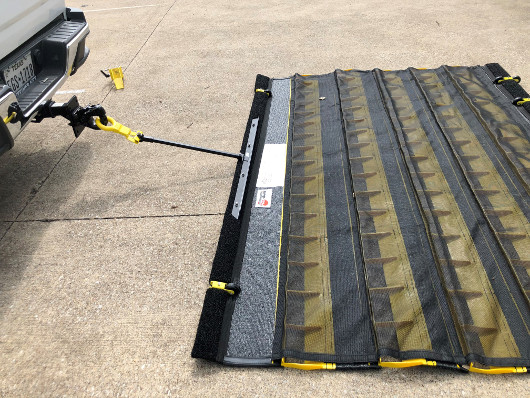

<!-- NUS LOGO DISPLAY -->

  

# Autonomous Runway Inspection & Active FOD Remediation Robot

## Draft Report for CDE 4301

_In Collaboration with the Republic of Singapore Air Force (RSAF) and Robotics & Autonomous Systems Innovation and Development (RAiD)_
_Innovation & Design Programme | College of Design and Engineering | National University of Singapore_

---

### Project Details

_Table 0.1: Project Team and Faculty Supervision Details_

| Project Team (UGV Focus) | Student ID  |     | Supervision & Faculty             |
| :----------------------- | :---------- | :-- | :-------------------------------- |
| **Hilbert Soh**          | `A0308263H` |     | **Dr Tang Kok Zuea**              |
| **Asuka**                | `[add ID]`  |     | Innovation & Design Programme     |
| **Gabriel Tan**          | `A0308452H` |     | College of Design and Engineering |
| **Zacarias Ng**          | `A0306899H`  |     | National University of Singapore  |
| **Bryan Ng**             | `[add ID]`  |     |                                   |

---

## Table of Contents

1. [Introduction](#1-introduction)
2. [Problem Statement](#2-problem-statement)
3. [Existing Systems](#3-existing-systems)
4. [Multi-Agent System Architecture & Rationale (UAV + UGV)](#4-multi-agent-system-architecture--rationale-uav--ugv)
5. [Robot Roles & Mission Operational Workflow](#5-robot-roles--mission-operational-workflow)
6. [Classification of Foreign Object Debris (FOD) & Surface Defects](#6-classification-of-foreign-object-debris-fod--surface-defects)
7. [UGV Design Specifications & Operational Features](#7-ugv-design-specifications--operational-features)
8. [UGV Sensor Suite for FOD Detection & Navigation Stack](#8-ugv-sensor-suite-for-fod-detection--navigation-stack)
9. [Individual Scope](#9-individual-scope)
   - [9.1 Hilbert Soh: Drone-Guided Autonomous Navigation and Obstacle Avoidance](#91-hilbert-soh-drone-guided-autonomous-navigation-and-obstacle-avoidance)
   - [9.2 Asuka: [Scope Title]](#92-asuka-scope-title)
   - [9.3 Gabriel Tan: [Scope Title]](#93-gabriel-tan-scope-title)
   - [9.4 Zacarias Ng: [Scope Title]](#94-zacarias-ng-scope-title)
   - [9.5 Bryan Ng: [Scope Title]](#95-bryan-ng-scope-title)
10. [References](#10-references)

---

## 1. Introduction

Airfield operational readiness depends heavily on maintaining pristine, hazard-free runway surfaces. Foreign Object Debris (FOD)—encompassing metallic jet engine fasteners, asphalt spalls, maintenance tool components, and tire rubber fragments—poses a constant risk to military fighter jets and commercial transport aircraft. The ingestion of small debris into turbofan intakes or high-speed tire blowouts during takeoff roll can result in structural airframe destruction, engine failure, or catastrophic loss of life.

_Figure 1.1: Typical Foreign Object Debris (FOD) items found on operational runways, demonstrating the scale and variety of physical hazards._

Traditional manual sweeps ("FOD walks") or manned vehicle patrols are inherently slow, labor-intensive, subject to human operator fatigue, and require extended runway closures that directly restrict operational sortie generation. While commercial stationary camera towers (such as iFerret™ 2.0) provide automated visual alerts, they require significant capital infrastructure investment and lack physical remediation capabilities.

Project **Runway Patrol** introduces a **Heterogeneous Multi-Agent Autonomous Architecture (UAV + UGV)** engineered for rapid airfield inspection and target hazard remediation at large operational airbases and commercial airports, such as Singapore Changi Airport Terminal 5 (5 km length × 60 m width). Developed under CDE 4301 at the National University of Singapore (NUS) in collaboration with defense and technical partners (**RSAF** and **RAiD**), this system pairs an Unmanned Aerial Vehicle (UAV) with an Unmanned Ground Vehicle (UGV).

While the overall project establishes a collaborative framework between two sub-teams, this report focuses specifically on the engineering, system architecture, sensor payloads, and control algorithms of the **UGV ground platform**.

---

## 2. Problem Statement

Current military and commercial airfield surface management protocols present three major operational bottlenecks:

1. **Excessive Runway Occupancy Time (ROT):** Manual visual sweeps by human ground personnel or slow vehicle patrols require long windows of total runway closure (~5 km at Changi T5), directly conflicting with tight flight scheduling and military operational tempo.
2. **The "Detect-to-Clear" Latency Gap:** Fixed optical systems (e.g., iFerret™ 2.0 or tower-mounted millimeter-wave radars) can flag debris locations, but they cannot physically retrieve objects. Ground crews must still be manually dispatched, drive out, locate, and collect the hazard, causing prolonged operational downtime.
3. **Environmental & Payload Trade-Offs in Single-Robot Paradigms:** Aerial drones alone lack the battery capacity and mechanical structure needed to transport heavy physical clearance tools (e.g., high-power magnets, industrial vacuum pumps). Conversely, standalone ground vehicles lack the high-altitude, wide field-of-view line of sight required to rapidly scan multi-kilometer asphalt strips.

---

## 3. Existing Systems

Existing runway inspection and FOD detection solutions across international commercial and military airfields fall into three primary categories:

### 3.1 Manual Visual Inspections & "FOD Walks"

Trained maintenance personnel conduct scheduled visual patrols on foot or inside low-speed ground utility vehicles. While highly flexible and capable of qualitative assessment, human inspection is vulnerable to visual fatigue, nighttime illumination constraints, weather hazards (rain, fog, heat haze), and high error rates for small metallic items (< 2 cm).

### 3.2 Fixed Infrastructure-Based Sensing Systems

_Table 3.1: Comparative Analysis of Fixed Infrastructure FOD Sensing Technologies_

| System Name           | Primary Technology                                                 | Deployment Locations                         | Key Operational Limitations                                                               |
| :-------------------- | :----------------------------------------------------------------- | :------------------------------------------- | :---------------------------------------------------------------------------------------- |
| **iFerret™ 2.0**      | High-Definition Electro-Optical Pan-Tilt-Zoom (PTZ) Arrays         | Singapore Changi, Dubai Intl, Hong Kong Intl | High capital expenditure; sensitive to fog/heavy rain; lacks active removal capabilities. |
| **FODetect / XSight** | Runway edge-light integrated Optical + mmW Radar units (76–77 GHz) | Boston Logan Intl (BOS)                      | Requires high sensor density (every ~60 m); high maintenance cost; stationary only.       |
| **Tarsier Radar**     | Tower-mounted Millimeter-Wave Radar (94.5 GHz) + Optical Cameras   | London Heathrow, Vancouver Intl              | Radar shadow zones caused by terrain elevation; high initial installation footprint.      |

_Figure 3.1: The iFerret™ 2.0 High-Definition Electro-Optical Pan-Tilt-Zoom (PTZ) sensor unit deployed for automated airfield visual surveillance._

### 3.3 Conventional Mechanical Removal Sweepers & Mobile Clearing Vehicles

Airport operations utilize heavy power broom sweepers, industrial vacuum trucks, or towed friction drag-mats (e.g., FOD-Razor™). These systems operate blindly without real-time detection, requiring continuous full-sweep traversals that consume significant fuel and block active flight lanes.

_Figure 3.2: Towed mechanical friction drag-mat utilized for continuous physical capture of loose runway debris._

---

## 4. Multi-Agent System Architecture & Rationale (UAV + UGV)

Project **Runway Patrol** utilizes a **Heterogeneous Collaborative Framework** to combine the unique physical strengths of aerial and ground robotics into a unified "Find-and-Fix" operational loop:

_Figure 4.1: Collaborative multi-robot architecture illustrating the dynamic interaction between aerial scouting (UAV) and targeted ground remediation (UGV)._

### Operational & Engineering System Justifications

_Table 4.1: Operational and Engineering Performance Metrics across Inspection Paradigms_

| Mission Metric            | UAV Only                             | UGV Only                                  | Joint UAV + UGV (Selected)                          |
| :------------------------ | :----------------------------------- | :---------------------------------------- | :-------------------------------------------------- |
| **Area Sweep Velocity**   | ⚡ Fastest (High altitude coverage)  | 🐢 Slow (Limited ground line-of-sight)    | ⚡ **Fastest** (UAV handles macro grid scan)        |
| **Physical Clearance**    | ❌ Impossible (Weight/thrust limits) | 🟩 High (Carries heavy vacuum/payloads)   | 🟩 **High** (UGV dispatched only when cued)         |
| **Runway Occupancy**      | 🟩 Minimal (Airborne)                | ❌ High (Occupies lane continuously)      | 🟩 **Optimized** (UGV targets specific coordinates) |
| **Verification Accuracy** | ⚠️ Moderate (Heat haze / altitude)   | 🟩 Precision (Centimeter-range LiDAR/RGB) | 🟩 **Precision** (UGV verifies before extraction)   |

---

## 5. Robot Roles & Mission Operational Workflow

The end-to-end operational pipeline links the UAV and UGV platforms via an automated data chain:

1. **Macro Aerial Scouting (UAV Phase):** The UAV flies a lawnmower grid pattern over the runway strip at a set altitude, utilizing high-resolution RGB imagery and onboard semantic segmentation to detect surface anomalies and pavement cracks.
2. **Target Cuing & C2 Handshake:** Upon detecting candidate FOD or pavement distress, the UAV tags the location using RTK-GPS coordinates and sends a structured JSON payload over a secure wireless telemetry link.
3. **Precision Transit (UGV Phase):** The UGV receives the goal waypoint via ROS 2 Nav2, plans an obstacle-free ground path, and travels directly to the target zone.
4. **Close-Range Verification:** Operating within a 2-meter radius of the target, the UGV fuses mmW radar, 3D LiDAR, and RGB/Infrared vision to confirm the anomaly, filtering out false positives such as shadows or painted pavement markings.
5. **Active Collection & Discharge:** The UGV drives over the verified object, activating its electromagnetic bar for metallic debris or its suction mechanism for non-ferrous objects. Once collected, the UGV updates the central database and returns to its station or proceeds to the next waypoint.

---

## 6. Classification of Foreign Object Debris (FOD) & Surface Defects

To ensure effective target classification and payload deployment, objects on the runway are categorized based on physical properties, material composition, and structural defect profiles:

_Table 6.1: Airfield Hazard Taxonomy and Remediation Strategy Matrix_

| Category               | Target Examples                                                                  | Primary Hazard Vector                          | UGV Remediation Strategy                                         |
| :--------------------- | :------------------------------------------------------------------------------- | :--------------------------------------------- | :--------------------------------------------------------------- |
| **Metallic FOD**       | Aircraft rivets, bolts, safety wires, loose engine blades, maintenance tools     | Tire punctures, turbine blade shredding        | High-intensity front electromagnetic bar activation              |
| **Non-Metallic FOD**   | Tire rubber chunks, loose aggregate gravel, asphalt spalls, plastic luggage tags | Engine ingestion, sensor blockages             | Underbody high-flow vacuum inlet & friction drag-mats            |
| **Organic Debris**     | Wildlife remnants, windblown soil, mud clumps                                    | Loss of pavement skid resistance               | Mechanical brush collection & vacuum capture                     |
| **Structural Defects** | Pavement cracking (alligator, longitudinal), construction joint failure          | Pavement degradation leading to FOD generation | Georeferenced mapping for maintenance logging (PCI / ASTM D5340) |

---

## 7. UGV Design Specifications & Operational Features

The UGV ground platform is engineered specifically for high-speed transit and active physical collection on airfield asphalt surfaces:

- **High-Mobility Skid-Steer / Differential Drive Chassis:** Constructed from lightweight aluminum alloy with all-terrain rubber tires, providing zero-turn-radius maneuvering and stability at high operational transit speeds.
- **Dual Active Clearance Payloads:**
  - _Front Electromagnetic Bar:_ A switchable high-power electromagnet array mounted on the front bumper to instantly attract and collect ferrous metal hazards prior to tire contact.
  - _Underbody Friction & Vacuum Intake Module:_ A high-flow suction nozzle paired with trailing polymer friction mats to capture non-metallic debris, gravel, and rubber fragments.
- **Onboard Industrial Edge AI Compute:** Features an embedded AI processing unit (e.g., NVIDIA Jetson Orin series) executing real-time deep learning inference, sensor fusion, and local SLAM mapping.
- **Fail-Safe Airside Safety Mechanisms:** Includes automatic Return-To-Base (RTB) protocols triggered by low battery levels or telemetry link loss, software-level hard stops, and active dynamic obstacle avoidance to prevent collision with airfield assets.

---

## 8. UGV Sensor Suite for FOD Detection & Navigation Stack

To operate reliably under varying weather conditions, the UGV uses a multi-modal sensor fusion pipeline:

_Table 8.1: UGV Multi-Modal Sensor Payload and Navigation Specifications_

| Sensor Type                   | Hardware / Band                         | Primary Operational Function                                                                                           |
| :---------------------------- | :-------------------------------------- | :--------------------------------------------------------------------------------------------------------------------- |
| **Automotive mmW Radar**      | 77–79 GHz / 94 GHz FMCW Radar           | Provides target cueing and object detection through heavy fog, rain, dust, and nighttime darkness.                     |
| **3D Profiling LiDAR**        | 32-Channel Solid-State 3D LiDAR         | Generates high-density point clouds for surface height anomaly detection (>2 cm) and real-time SLAM localization.      |
| **High-Res RGB Camera Array** | Stereo CMOS Optical Cameras             | Provides high-resolution pixel data for AI visual classification (YOLOv8 / U-Net) to identify small object geometries. |
| **Infrared (Thermal) Camera** | Long-Wave Infrared (LWIR) Sensor        | Utilizes thermal contrast differences between foreign materials and asphalt during nighttime operations.               |
| **GNSS-RTK + IMU Stack**      | Dual-Frequency RTK-GPS + High-Grade IMU | Delivers centimeter-level global positioning for precision waypoint navigation, supplemented by dead reckoning.        |

---

## 9. Individual Scope

_Table 9.1: Individual Team Member Scope Summary_

| Member Name     | Scope Title                                                             | Key Responsibilities & Summary                                                                                                                                                                                                                                                                    |
| :-------------- | :---------------------------------------------------------------------- | :------------------------------------------------------------------------------------------------------------------------------------------------------------------------------------------------------------------------------------------------------------------------------------------------ |
| **Hilbert Soh** | **Drone-Guided Autonomous Navigation and Obstacle Avoidance for a UGV** | Build a messaging module to parse/validate incoming drone waypoints; implement SLAM for real-time localization and map building; integrate path planning algorithms for waypoint navigation and obstacle avoidance; test wireless communication reliability, waypoint accuracy, and safety stops. |
| **Asuka**       | _[Insert Scope Title]_                                                  | _[Insert brief summary of key responsibilities]_                                                                                                                                                                                                                                                  |
| **Gabriel Tan** | _[Insert Scope Title]_                                                  | _[Insert brief summary of key responsibilities]_                                                                                                                                                                                                                                                  |
| **Zacarias Ng** | _[Insert Scope Title]_                                                  | _[Insert brief summary of key responsibilities]_                                                                                                                                                                                                                                                  |
| **Bryan Ng**    | _[Insert Scope Title]_                                                  | _[Insert brief summary of key responsibilities]_                                                                                                                                                                                                                                                  |

### Detailed Individual Scopes

#### 9.1 Hilbert Soh: Drone-Guided Autonomous Navigation and Obstacle Avoidance

**Objectives**

- Establish a communication link to receive target waypoints from a drone.
- Execute autonomous navigation and path-following to reach drone-assigned goals.
- Detect and dynamically avoid obstacles along the path in outdoor environments.

**Key Responsibilities**

- Build a messaging module to parse and validate incoming drone waypoints.
- Implement SLAM for real-time localization and map building.
- Integrate path planning algorithms to navigate toward waypoints while avoiding obstacles.
- Test wireless communication reliability, waypoint accuracy, and safety stops on signal loss.

**Hardware/Software Components**

- **Communication:** MAVLink, ROS 2 Topics/Services, Telemetry Radio / Wi-Fi
- **Sensors:** LiDAR, Depth Camera, IMU, GPS / RTK
- **Software:** ROS / ROS 2 (Nav2), SLAM Toolbox
- **Compute:** Onboard Computer (e.g., NVIDIA Jetson, Intel NUC)

**Expected Deliverables [Individual]**

- Drone-to-UGV waypoint communication module
- Autonomous navigation and mapping stack
- Demonstration of drone-guided navigation with dynamic obstacle avoidance
- Navigation and telemetry performance report

---

#### 9.2 Asuka: [Scope Title]

_(Add detailed scope breakdown here)_

---

#### 9.3 Gabriel Tan: [Scope Title]

_(Add detailed scope breakdown here)_

---

#### 9.4 Zacarias Ng: [Scope Title]

_(Add detailed scope breakdown here)_

---

#### 9.5 Bryan Ng: [Scope Title]

_(Add detailed scope breakdown here)_

---

## 10. References

1. Krestenitis, M., Petropoulos, A., Koulalis, I., Stipanovic, I., Skaric Palic, S., Ioannidis, K., & Vrochidis, S. (2026). Digitalization and Automation of Runway Inspection Using Unmanned Aerial Vehicles. _Sensors_, 26(1100), 1–17.
2. Shan, J., Miccinesi, L., Beni, A., Pagnini, L., Cioncolini, A., & Pieraccini, M. (2025). A Review of Foreign Object Debris Detection on Airport Runways: Sensors and Algorithms. _Remote Sensing_, 17(225), 1–33.
3. Yamamoto, H., Sattar, R. A., Wang, J., Mendez, L. F., & Rakas, J. (2016). _Drone-enabled Foreign Object Debris (FOD) Removal System in ad hoc Situations_. UC Berkeley ACRP University Design Competition Report.
4. Stratec Intelligent Vision / NCS / Changi Airport Group. (2024). _iFerret™ 2.0 AI-Powered Foreign Object Debris Detection System Brochure_. CAG / NCS Airside Solutions.
5. Federal Aviation Administration (FAA). (2014). _Airport Foreign Object Debris (FOD) Management Equipment_. FAA Advisory Circular AC 150/5220-24.
6. ASTM International. (2020). _Standard Test Method for Airport Pavement Condition Index Surveys_. ASTM D5340-20.
