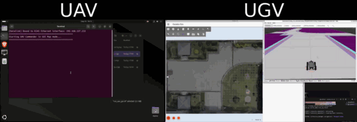
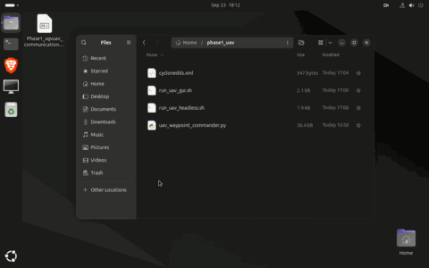
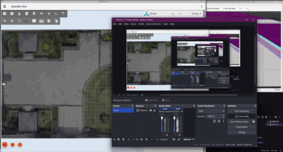
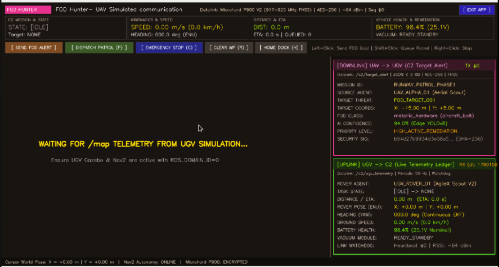

# 🚁 Phase 1: UAV-to-UGV Inter-Agent Communication & C2 Tactical Guide

> **Project Runway Patrol** • Heterogeneous Multi-Agent Autonomous Runway Inspection & Clearance System  
> **Phase 1: Multi-Machine Benchtop Simulation & C2 Telemetry Datalink**

---

## 🎥 Benchtop Demonstration & Video Showcase

<div align="center">
  <table>
    <tr>
      <td colspan="2" align="center">
        <b>🎬 Synchronized Dual-Agent Demonstration (Full System Sync)</b><br><br>
        <a href="assets/UAV-UGV%20Communication%20video.mp4">
          
        </a>
        <br><br>
        <sub><a href="assets/UAV-UGV%20Communication%20video.mp4"><b>▶ Download / Watch Full 60 FPS Video (assets/UAV-UGV Communication video.mp4)</b></a></sub>
      </td>
    </tr>
    <tr>
      <td align="center" width="50%">
        <b>🍓 Machine 1: Raspberry Pi 5 (UAV C2 Station)</b><br><br>
        <a href="assets/230926%20UAVUGV%20comms%20Rpi5%20.mp4">
          
        </a>
        <br><br>
        <sub><a href="assets/230926%20UAVUGV%20comms%20Rpi5%20.mp4"><b>▶ Download / Watch RPi5 Video (assets/230926 UAVUGV comms Rpi5 .mp4)</b></a></sub>
      </td>
      <td align="center" width="50%">
        <b>💻 Machine 2: Laptop (Gazebo & Nav2 UGV)</b><br><br>
        <a href="assets/230926%20UAVUGV%20comms%20Laptop.mp4">
          
        </a>
        <br><br>
        <sub><a href="assets/230926%20UAVUGV%20comms%20Laptop.mp4"><b>▶ Download / Watch Laptop Video (assets/230926 UAVUGV comms Laptop.mp4)</b></a></sub>
      </td>
    </tr>
  </table>
</div>

---

## 📌 Architecture & System Topology

This document provides complete instructions to operate and demonstrate the **Phase 1 Inter-Agent Communication Datalink** between:
- **Machine 1 (Raspberry Pi 5):** UAV Aerial Scout & C2 Tactical Ground Station GUI (`uav-sim@uavsim-desktop.local`).
- **Machine 2 (Laptop / PC):** UGV Gazebo Harmonic Digital Twin (`AgileX Scout V2`), Nav2 Autonomy Stack & C2 Telemetry Bridge.

```text
┌──────────────────────────────────────────────┐                ┌──────────────────────────────────────────────┐
│             MACHINE 1: RASPBERRY PI 5        │                │             MACHINE 2: LAPTOP / PC           │
│     (UAV Aerial Scout & C2 Ground Station)   │                │     (Gazebo Simulation & Nav2 UGV Rover)     │
│             IP: 192.168.137.233              │  Direct RJ45   │              IP: 192.168.137.1               │
│                                              │ Ethernet Cable │                                              │
│  • Tactical HUD & Live Telemetry Console     │ ◄────────────► │  • Gazebo Harmonic 3D Digital Twin           │
│  • Live /map Stream (RViz2 Grey/Black Theme) │                │  • Nav2 Autonomous Path Planner & Controller │
│  • Dispatches C2 FOD Target Alerts (JSON)    │ ─────────────► │  • Ingests Target Alerts & Drives Rover      │
│    (Topic: /c2/target_alert - Downlink)      │                │  • Remediates Target (Vacuum Suction Module) │
│  • Ingests UGV Telemetry Ledger (JSON)       │ ◄───────────── │  • Broadcasts Live Telemetry & Task Ledger   │
│    (Topic: /c2/ugv_telemetry - Uplink)       │  CycloneDDS    │    (ACKNOWLEDGED -> EN_ROUTE -> COLLECTED)   │
│  • Auto-Reverse Home Charging Dock Procedure │                │  • Static Base Dock at (-25.0, 0.0)          │
└──────────────────────────────────────────────┘                └──────────────────────────────────────────────┘
```

---

## ⚡ Direct RJ45 Ethernet Network Configuration

Both machines are connected via a direct point-to-point RJ45 Ethernet cable on the `192.168.137.0/24` subnet:

| Device | Subnet IP | Primary Interface | Role |
| :--- | :--- | :--- | :--- |
| **Laptop / PC** | `192.168.137.1` | `eth1` (or `enp...`) | Gazebo Harmonic, Nav2, Robot State Publisher, UGV C2 Bridge |
| **Raspberry Pi 5** | `192.168.137.233` | `eth0` (or `end0`) | UAV Tactical C2 GUI / Headless CLI Commander |

### Unified CycloneDDS Configuration (`cyclonedds.xml`)
Both machines utilize a single, unified DDS configuration that automatically routes traffic through the RJ45 Ethernet interface with direct unicast peer discovery:

```xml
<?xml version="1.0" encoding="UTF-8" ?>
<CycloneDDS xmlns="https://cdds.io/config" xmlns:xsi="http://www.w3.org/2001/XMLSchema-instance">
    <Domain id="any">
        <General>
            <Interfaces>
                <NetworkInterface address="auto" priority="default" multicast="default" />
            </Interfaces>
        </General>
        <Discovery>
            <Peers>
                <Peer address="192.168.137.1"/>
                <Peer address="192.168.137.233"/>
            </Peers>
        </Discovery>
    </Domain>
</CycloneDDS>
```

---

## 📂 Raspberry Pi 5 Clean Deployment Setup

On the Raspberry Pi 5, the entire C2 Ground Station is self-contained in `~/phase1_uav/` with only **4 essential files**:

```text
~/phase1_uav/
├── uav_waypoint_commander.py   # Standalone Tactical C2 GUI / CLI Commander
├── cyclonedds.xml              # Unified CycloneDDS Network Configuration
├── run_uav_gui.sh              # 1-Click Launcher for 2D Tactical Map GUI
└── run_uav_headless.sh         # 1-Click Launcher for Headless SSH CLI Mode
```

### Sync Files to Raspberry Pi 5 (from Laptop)
```bash
scp \
  ~/runway_sim_ws/src/runway_navigation/runway_navigation/uav_waypoint_commander.py \
  ~/runway_sim_ws/cyclonedds.xml \
  ~/runway_sim_ws/run_uav_gui.sh \
  ~/runway_sim_ws/run_uav_headless.sh \
  uav-sim@uavsim-desktop.local:~/phase1_uav/
```

---

## 🚀 Step-by-Step Launch Procedure

### Step 1: Start Gazebo Simulation on Laptop
Open **Terminal 1** on the laptop:
```bash
source /opt/ros/jazzy/setup.bash && source ~/runway_sim_ws/install/setup.bash
ros2 launch runway_description sim_nus_ea.launch.py
```
*(Gazebo Harmonic spawns the AgileX Scout V2 UGV in the NUS EA Field environment).*

---

### Step 2: Start Nav2 & C2 Telemetry Bridge on Laptop
Open **Terminal 2** on the laptop:
```bash
source /opt/ros/jazzy/setup.bash && source ~/runway_sim_ws/install/setup.bash
ros2 launch runway_navigation bringup_nav2.launch.py world_name:=nus_ea_field
```
*(Initializes the map server, costmaps, planner, pure-pursuit controller, RViz2, and `ugv_c2_bridge_node`).*

---

### Step 3 (Optional): Spawn Pedestrians in Field
Open **Terminal 3** on the laptop:
```bash
ros2 run ros_gz_sim create -file ~/runway_sim_ws/src/runway_description/models/person/model.sdf -name person_1 -x -1.95 -y 10.32 -z 0.0 && \
ros2 run ros_gz_sim create -file ~/runway_sim_ws/src/runway_description/models/person/model.sdf -name person_2 -x 4.39 -y 8.48 -z 0.0 && \
ros2 run ros_gz_sim create -file ~/runway_sim_ws/src/runway_description/models/person/model.sdf -name person_9 -x -5.13 -y 5.14 -z 0.0 && \
ros2 run ros_gz_sim create -file ~/runway_sim_ws/src/runway_description/models/person/model.sdf -name person_11 -x -12.62 -y 2.65 -z 0.0 && \
ros2 run ros_gz_sim create -file ~/runway_sim_ws/src/runway_description/models/person/model.sdf -name person_14 -x -17.67 -y 0.23 -z 0.0
```

---

### Step 4: Launch Tactical C2 Ground Station on Raspberry Pi 5

#### **Option A: 2D Tactical Visual Map GUI (Recommended)**
On the RPi5 desktop (or via VNC/direct monitor):
```bash
cd ~/phase1_uav
chmod +x run_uav_gui.sh
./run_uav_gui.sh
```

#### **Option B: Headless Terminal CLI (via SSH)**
```bash
ssh uav-sim@uavsim-desktop.local
cd ~/phase1_uav
chmod +x run_uav_headless.sh
./run_uav_headless.sh
```

---

## 🖥️ Tactical GUI Layout & Features

<div align="center">
  
  <br>
  <sub><b>Figure 1:</b> Raspberry Pi 5 Tactical C2 Ground Station Interface (<code>uav_waypoint_commander.py</code>) displaying real-time HUD telemetry, Microhard P900 datalink status, C2 Downlink/Uplink ledgers, and interactive 2D map dispatch controls.</sub>
</div>
<br>

```text
┌────────────────────────────────────────────────────────────────────────────────────────────────────────┐
│ [FOD HUNTER]  FOD Hunter- UAV Simulated communication   Datalink: Microhard P900 | -64 dBm [ EXIT APP ]│
├───────────────────┬───────────────────┬───────────────────┬───────────────────┬────────────────────────┤
│ C2 MISSION & STATE│ KINEMATICS & SPEED│ DISTANCE & ETA    │ VEHICLE HEALTH    │ [ SEND FOD ALERT ]     │
│ STATE: [EN_ROUTE] │ SPEED: 1.20 m/s   │ DIST: 8.4 m       │ BATTERY: 98.2%    │ [ DISPATCH PATROL (P) ]│
│ Target: FOD_TRG_01│ HEADING: 045.0 deg│ ETA: 7.0 s        │ VACUUM: ACTIVE    │ [ EMERGENCY STOP (C) ] │
├───────────────────┴───────────────────┴───────────────────┴───────────────────┼────────────────────────┤
│                                                                               │ [DOWNLINK] UAV -> UGV  │
│                                                                               │ MISSION: RUNWAY_PATROL │
│                         TACTICAL RADAR MAP                                    │ THREAT:  FOD_THREAT_001│
│                                                                               │ COORDS:  X:-15.0 Y:5.0 │
│   • Drivable Area: Clean Grey (#CDCDCD)                                       │ CLASS:   aircraft_bolt │
│   • Zone-Out / Perimeter: Solid Black (#0F0F12)                               │ CONF:    96.0% YOLOv8  │
│   • 5-Meter Coordinate Grid Overlay                                           ├────────────────────────┤
│   • Live Robot Hull, Heading Arrow & Planned Path                             │ [UPLINK] UGV -> C2     │
│   • Home Dock Base at (-25.0, 0.0)                                            │ STATE:   [EN_ROUTE]    │
│                                                                               │ POSE:    X:-20.4 Y:1.2 │
│                                                                               │ SPEED:   1.20 m/s      │
│                                                                               │ BATTERY: 98.2% (25.1V) │
│                                                                               │ VACUUM:  ACTIVE_SUCTION│
├───────────────────────────────────────────────────────────────────────────────┴────────────────────────┤
│ Cursor World Pose: X = -12.40 m | Y = +3.20 m  |  Nav2 Autonomy: ONLINE  |  Microhard P900: ENCRYPTED  │
└────────────────────────────────────────────────────────────────────────────────────────────────────────┘
```

---

## 🎯 Live Demonstration Flow (Examiner Walkthrough)

### 1. Real-Time Occupancy Grid Ingestion
- Show that the RPi5 automatically receives the full `/map` stream from the Laptop via CycloneDDS over the RJ45 link without any local map files required on the RPi5.

### 2. Dispatching an Autonomous Intercept Mission
- **In GUI:** Click the **`[ SEND FOD ALERT ]`** button or **Left-Click** on any point in the courtyard.
- **In CLI:** Type `goto -15.0 5.0` and press <kbd>Enter</kbd>.
- **Observe:**
  1. Downlink card increments `TX #1` and publishes Section 3.1 JSON on `/c2/target_alert`.
  2. UGV transitions: `IDLE` $\rightarrow$ `ACKNOWLEDGED` $\rightarrow$ `EN_ROUTE`.
  3. Real-time path planning line renders on the map and the UGV begins navigating in Gazebo.

### 3. Queueing Multi-Point Sequential Patrol
- **In GUI:** Hold <kbd>Shift</kbd> and **Left-Click** 3 points along the walkway, then click **`[ DISPATCH PATROL (P) ]`** or press <kbd>P</kbd>.
- **In CLI:** Type `patrol -20,2 -15,5 -5,2` and press <kbd>Enter</kbd>.
- **Observe:** Amber waypoint badges with line segments guide the robot sequentially through all poses.

### 4. Verification & Active Debris Remediation
- When the rover reaches the FOD threat:
  $$\text{EN\_ROUTE} \longrightarrow \text{VERIFIED} \longrightarrow \mathbf{COLLECTED / REMEDIATED!}$$
- Top HUD and Uplink card display **`VACUUM: ACTIVE_SUCTION`** to confirm remediation.

### 5. Automated Reverse-In Home Docking
- Click **`[ HOME DOCK (H) ]`** or press <kbd>H</kbd> (or type `home` in CLI).
- **Observe:** The UGV navigates to the staging point `(-22.0, 0.0)`, aligns its hull outward (`Yaw = 0.0 rad`), and reverses into the charging dock bay at `(-25.0, 0.0)`!

---

## 🕹️ Quick Controls Reference

| Action | GUI Mouse / Key | Headless CLI Command | Description |
| :--- | :--- | :--- | :--- |
| **Send Single Goal** | **Left Click** on map | `goto <x> <y>` | Dispatches single FOD alert & drives rover |
| **Queue Patrol Point**| **Shift + Left Click**| `patrol <x1,y1> <x2,y2>` | Queues sequential inspection waypoints |
| **Dispatch Patrol** | Click Button or <kbd>P</kbd> | Handled automatically | Dispatches multi-pose patrol goal to Nav2 |
| **Emergency Stop** | Click Button or <kbd>C</kbd> / Right-Click | `cancel` / `stop` | Immediately cancels navigation and stops rover |
| **Clear Queue** | Click Button or <kbd>R</kbd> | `clear` | Clears all un-dispatched patrol points |
| **Home Dock** | Click Button or <kbd>H</kbd> | `home` | Executes 2-step reverse docking into `(-25, 0)` |
| **Exit Application**| Click `[ EXIT APP ]` / <kbd>Q</kbd> | `exit` / `quit` | Cleanly shuts down node and closes window |

---

## ❓ Troubleshooting

| Symptom | Cause | Quick Fix |
| :--- | :--- | :--- |
| **"Waiting for /map telemetry..."** | Nav2 was stopped or not yet launched. | Ensure Terminal 2 (`bringup_nav2.launch.py`) is actively running on the laptop. |
| **`failed to create domain` on RPi5** | Missing or malformed CycloneDDS XML. | Launch using `./run_uav_gui.sh`, which automatically detects the `192.168.137.x` Ethernet IP. |
| **`cv2.error` or display error on RPi5** | RPi5 launched via text-only SSH without display. | Use `./run_uav_headless.sh` for terminal CLI or use `ssh -X` for X11 forwarding. |
| **UGV not moving in Gazebo** | Gazebo was not started before Nav2. | Ensure Gazebo is running in Terminal 1 before launching Nav2 in Terminal 2. |

---

<div align="center">
  <sub>Project Runway Patrol • NUS CDE • Heterogeneous Multi-Agent Autonomous Runway System</sub>
</div>
