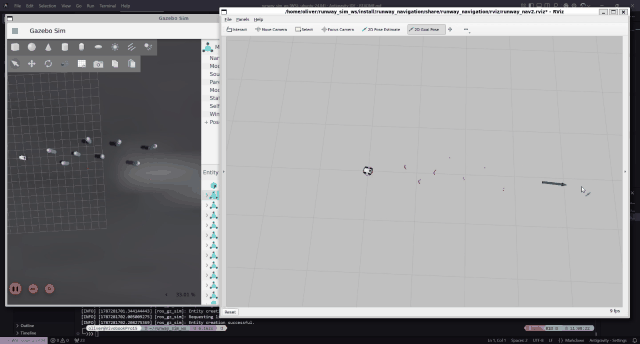
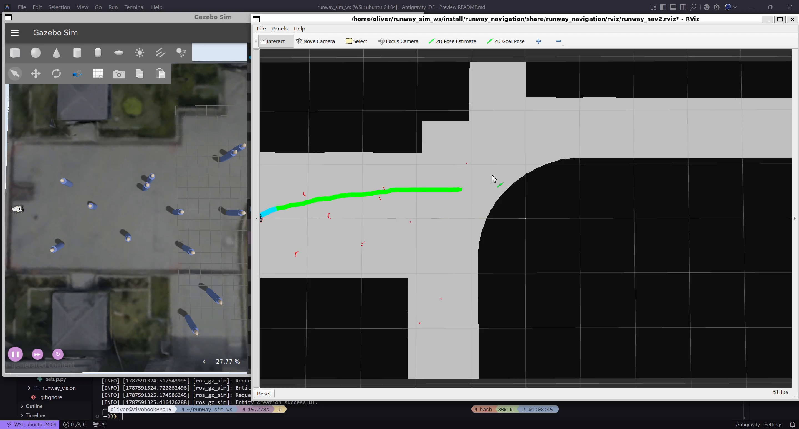
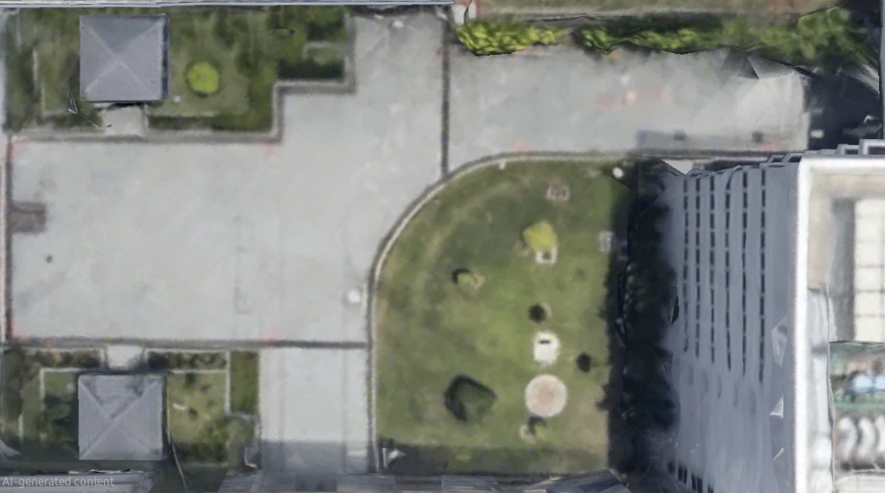
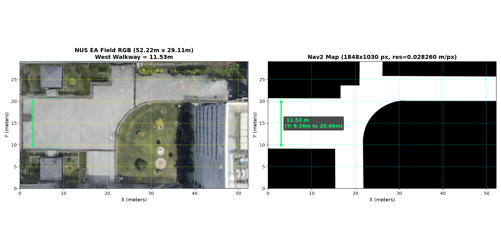
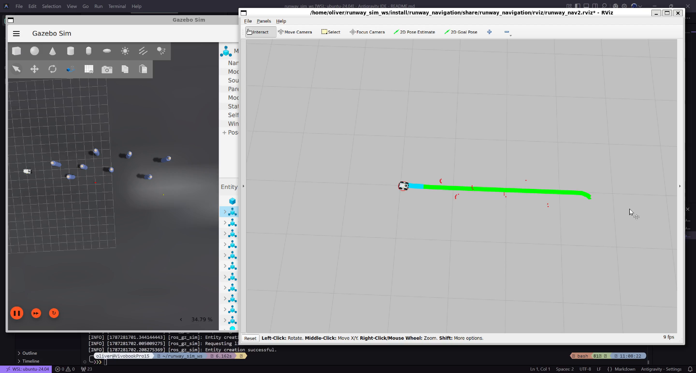
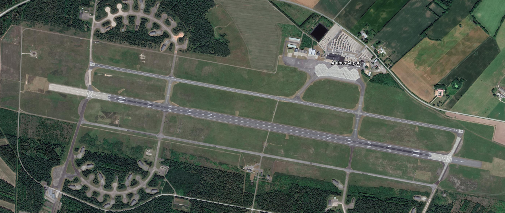
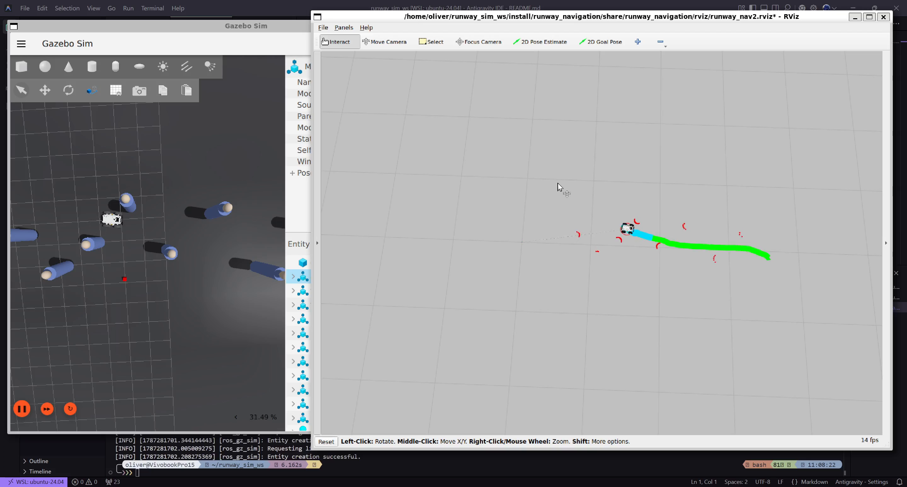

<div align="center">

# 🛩️ Aarhus Airport Runway Patrol & Autonomous Navigation UGV

<p align="center">
  <b>Autonomous Runway Inspection & Navigation System</b><br>
  Modeled after <b>Aarhus Airport (IATA: AAR, ICAO: EKAH)</b><br>
  Built with <b>ROS 2 Jazzy</b>, <b>Gazebo Sim (Harmonic)</b>, and <b>Nav2</b>.
</p>

<p align="center">
  
  
  
  
  
  
</p>

</div>

---

## 🎥 Simulation Demo Showcase

<div align="center">
  <table>
    <tr>
      <td align="center" width="50%">
        <b>🛫 Aarhus Airport Runway Navigation & Patrol</b><br><br>
        <a href="assets/simulation_demo.mp4">
          
        </a>
        <br><br>
        <sub><a href="assets/simulation_demo.mp4"><b>▶ Download / Watch Full HD Video (assets/simulation_demo.mp4)</b></a></sub>
      </td>
      <td align="center" width="50%">
        <b>📍 NUS EA Field Autonomous Navigation & Avoidance</b><br><br>
        <a href="assets/nus_ea_simulation_demo.mp4">
          
        </a>
        <br><br>
        <sub><a href="assets/nus_ea_simulation_demo.mp4"><b>▶ Download / Watch Full 60 FPS Video (assets/nus_ea_simulation_demo.mp4)</b></a></sub>
      </td>
    </tr>
  </table>
</div>

---

## 📖 Overview & Simulation Environments

The system supports two distinct outdoor simulation environments:
1. **Aarhus Airport Runway (EKAH)**: A 100m high-fidelity asphalt runway for centerline inspection, high-speed patrol, and dynamic FOD obstacle avoidance.
2. **NUS EA Field**: An outdoor campus courtyard featuring intricate concrete walkways, open grass areas, buildings, and custom pedestrian obstacle layouts.

<div align="center">
  <h3>📍 1. NUS EA Field Environment</h3>
  <table>
    <tr>
      <td align="center" width="50%">
        <b>🗺️ NUS EA Field Aerial Satellite Model</b><br><br>
        
      </td>
      <td align="center" width="50%">
        <b>📐 NUS EA Field Dimensions & Boundaries</b><br><br>
        
      </td>
    </tr>
  </table>

  <h3>📍 2. Aarhus Airport Runway (EKAH) Environment</h3>
  <table>
    <tr>
      <td align="center" width="50%">
        <b>🌐 Aarhus Airport (EKAH) Gazebo 3D Runway</b><br><br>
        
      </td>
      <td align="center" width="50%">
        <b>🛫 Aarhus Airport Runway Surface Model</b><br><br>
        
      </td>
    </tr>
  </table>
</div>

<table>
  <tr>
    <td width="50%">
      <h3>🤖 Robotic Platform</h3>
      <ul>
        <li><b>Chassis:</b> AgileX Scout V2 4WD differential-drive rover</li>
        <li><b>2D LiDAR:</b> Hokuyo laser scanner (<code>/scan</code>) for obstacle avoidance & costmap generation</li>
        <li><b>Forward Camera:</b> Optical sensor (<code>/camera/image_raw</code>) for forward visual feed</li>
        <li><b>State Estimation:</b> Wheel odometry + static runway map alignment</li>
      </ul>
    </td>
    <td width="50%">
      <h3>🧠 Autonomous Stack</h3>
      <ul>
        <li><b>Global Planning:</b> Nav2 NavFn (A* algorithm) covering the full 100m runway</li>
        <li><b>Local Controller:</b> DWB / Velocity smoother with collision avoidance</li>
        <li><b>Obstacle Avoidance:</b> Real-time dynamic costmap inflation & obstacle avoidance</li>
        <li><b>Visualization:</b> Pre-configured RViz2 inspection interface</li>
      </ul>
    </td>
  </tr>
</table>

---

## 🗂️ Repository Architecture

```text
runway_sim_ws/
├── assets/                   # Simulation demo video recordings, snapshots, & poster previews
│   ├── simulation_demo.mp4   # Full simulation demonstration video (HD 60fps)
│   ├── simulation_demo.gif   # Animated simulation demo preview (auto-plays on GitHub)
│   ├── demo_poster.jpg       # Video preview poster
│   ├── gazebo_runway_world.png # Gazebo 3D simulation runway world snapshot
│   ├── runway_ground_plane.png # Airport runway surface terrain model
│   └── rviz_inspection_view.png # RViz autonomous navigation screenshot
├── src/
│   ├── 📦 runway_description/       # URDF/XACRO model, sensor meshes, and Gazebo world
│   │   ├── launch/sim.launch.py     # Gazebo Harmonic launcher + ROS-GZ bridges
│   │   ├── meshes/                  # Base link, Hokuyo LiDAR, and wheel meshes (.dae)
│   │   ├── models/                  # Airport runway terrain, lighting, & person obstacle models
│   │   ├── urdf/                    # Scout V2 xacro definitions & sensor mount transforms
│   │   └── worlds/airport_runway.sdf # High-fidelity runway environment
│   │
│   └── 🧭 runway_navigation/        # Nav2 autonomous navigation & costmap stack
│       ├── config/nav2_params.yaml  # Tuned Nav2 parameters for ROS 2 Jazzy
│       ├── launch/bringup_nav2.launch.py # Map server, transforms, and Nav2 lifecycle
│       ├── launch/runway_navigation_launch.py # Custom lightweight navigation launcher
│       ├── maps/                    # 100m × 20m occupancy grid map (runway_map.yaml/pgm)
│       └── rviz/runway_nav2.rviz    # Pre-configured RViz2 inspection interface
│
└── 📄 README.md
```

---

## ⚙️ Prerequisites & One-Time Installation

If you are setting this up on a fresh machine or have never used ROS 2 before, follow these steps:

### 1. System Requirements
- **Operating System:** Ubuntu 24.04 LTS (Noble Numbat)
- **ROS Version:** ROS 2 Jazzy Jalisco
- **Simulator:** Gazebo Sim (Harmonic / `gz-sim`)

### 2. Install Required Packages
Open a terminal (<kbd>Ctrl</kbd> + <kbd>Alt</kbd> + <kbd>T</kbd>) and run:

```bash
sudo apt update && sudo apt install -y \
  python3-colcon-common-extensions \
  ros-jazzy-navigation2 \
  ros-jazzy-nav2-bringup \
  ros-jazzy-ros-gz-sim \
  ros-jazzy-ros-gz-bridge \
  ros-jazzy-robot-state-publisher \
  ros-jazzy-joint-state-publisher \
  ros-jazzy-xacro \
  ros-jazzy-tf2-ros \
  ros-jazzy-tf2-tools
```

---

## 🔨 Building the Project

Before running the simulation for the first time (or whenever code is modified), build the workspace:

```bash
cd ~/runway_sim_ws
source /opt/ros/jazzy/setup.bash
colcon build --symlink-install
source install/setup.bash
```

> [!NOTE]
> *`source /opt/ros/jazzy/setup.bash` loads ROS 2 commands, and `source install/setup.bash` loads this project's custom packages into the current terminal.*

---

## 🚀 Step-by-Step Running Guide

Running the simulation requires **2 separate terminal windows** (or 2 tabs). You can run either the **NUS EA Field** or the **Aarhus Airport Runway** environment.

---

### 🟢 Environment 1: NUS EA Field (Courtyard & Walkways)

#### **Terminal 1: Start Gazebo Simulation**
```bash
source /opt/ros/jazzy/setup.bash && source ~/runway_sim_ws/install/setup.bash
ros2 launch runway_description sim_nus_ea.launch.py
```
*(Wait ~5 seconds for Gazebo to load)*

#### **Terminal 2: Start Nav2 & RViz2**
```bash
source /opt/ros/jazzy/setup.bash && source ~/runway_sim_ws/install/setup.bash
ros2 launch runway_navigation bringup_nav2.launch.py world_name:=nus_ea_field
```

#### **Terminal 3 (Optional): Spawn people on Walkways & Courtyard**
```bash
ros2 run ros_gz_sim create -file ~/runway_sim_ws/src/runway_description/models/person/model.sdf -name person_1 -x -1.95 -y 10.32 -z 0.0 && \
ros2 run ros_gz_sim create -file ~/runway_sim_ws/src/runway_description/models/person/model.sdf -name person_2 -x 4.39 -y 8.48 -z 0.0 && \
ros2 run ros_gz_sim create -file ~/runway_sim_ws/src/runway_description/models/person/model.sdf -name person_3 -x 4.24 -y 7.52 -z 0.0 && \
ros2 run ros_gz_sim create -file ~/runway_sim_ws/src/runway_description/models/person/model.sdf -name person_4 -x 7.59 -y 10.24 -z 0.0 && \
ros2 run ros_gz_sim create -file ~/runway_sim_ws/src/runway_description/models/person/model.sdf -name person_5 -x 10.71 -y 9.51 -z 0.0 && \
ros2 run ros_gz_sim create -file ~/runway_sim_ws/src/runway_description/models/person/model.sdf -name person_6 -x 10.57 -y 7.11 -z 0.0 && \
ros2 run ros_gz_sim create -file ~/runway_sim_ws/src/runway_description/models/person/model.sdf -name person_7 -x 14.56 -y 8.61 -z 0.0 && \
ros2 run ros_gz_sim create -file ~/runway_sim_ws/src/runway_description/models/person/model.sdf -name person_8 -x 17.84 -y 9.78 -z 0.0 && \
ros2 run ros_gz_sim create -file ~/runway_sim_ws/src/runway_description/models/person/model.sdf -name person_9 -x -5.13 -y 5.14 -z 0.0 && \
ros2 run ros_gz_sim create -file ~/runway_sim_ws/src/runway_description/models/person/model.sdf -name person_10 -x -5.85 -y 4.59 -z 0.0 && \
ros2 run ros_gz_sim create -file ~/runway_sim_ws/src/runway_description/models/person/model.sdf -name person_11 -x -12.62 -y 2.65 -z 0.0 && \
ros2 run ros_gz_sim create -file ~/runway_sim_ws/src/runway_description/models/person/model.sdf -name person_12 -x -13.04 -y 1.90 -z 0.0 && \
ros2 run ros_gz_sim create -file ~/runway_sim_ws/src/runway_description/models/person/model.sdf -name person_13 -x -19.93 -y 2.28 -z 0.0 && \
ros2 run ros_gz_sim create -file ~/runway_sim_ws/src/runway_description/models/person/model.sdf -name person_14 -x -17.67 -y 0.23 -z 0.0 && \
ros2 run ros_gz_sim create -file ~/runway_sim_ws/src/runway_description/models/person/model.sdf -name person_15 -x -10.32 -y -0.28 -z 0.0 && \
ros2 run ros_gz_sim create -file ~/runway_sim_ws/src/runway_description/models/person/model.sdf -name person_16 -x -5.43 -y -0.36 -z 0.0 && \
ros2 run ros_gz_sim create -file ~/runway_sim_ws/src/runway_description/models/person/model.sdf -name person_17 -x -20.63 -y -3.27 -z 0.0 && \
ros2 run ros_gz_sim create -file ~/runway_sim_ws/src/runway_description/models/person/model.sdf -name person_18 -x -14.62 -y -2.43 -z 0.0 && \
ros2 run ros_gz_sim create -file ~/runway_sim_ws/src/runway_description/models/person/model.sdf -name person_19 -x -9.53 -y -3.50 -z 0.0 && \
ros2 run ros_gz_sim create -file ~/runway_sim_ws/src/runway_description/models/person/model.sdf -name person_20 -x -7.45 -y -7.32 -z 0.0 && \
ros2 run ros_gz_sim create -file ~/runway_sim_ws/src/runway_description/models/person/model.sdf -name person_21 -x -9.38 -y -9.60 -z 0.0
```

---

### 🟢 Environment 2: Aarhus Airport Runway (EKAH)

#### **Terminal 1: Start Gazebo Simulation**
```bash
source /opt/ros/jazzy/setup.bash && source ~/runway_sim_ws/install/setup.bash
ros2 launch runway_description sim_airport.launch.py
```

#### **Terminal 2: Start Nav2 & RViz2**
```bash
source /opt/ros/jazzy/setup.bash && source ~/runway_sim_ws/install/setup.bash
ros2 launch runway_navigation bringup_nav2.launch.py
```

#### **Terminal 3 (Optional): Spawn people on runway**
```bash
ros2 run ros_gz_sim create -file ~/runway_sim_ws/src/runway_description/models/person/model.sdf -name person_1 -x 4.0 -y 0.5 -z 0.0 && \
ros2 run ros_gz_sim create -file ~/runway_sim_ws/src/runway_description/models/person/model.sdf -name person_2 -x 5.5 -y -1.0 -z 0.0 && \
ros2 run ros_gz_sim create -file ~/runway_sim_ws/src/runway_description/models/person/model.sdf -name person_3 -x 7.0 -y 0.0 -z 0.0 && \
ros2 run ros_gz_sim create -file ~/runway_sim_ws/src/runway_description/models/person/model.sdf -name person_4 -x 8.5 -y 1.5 -z 0.0 && \
ros2 run ros_gz_sim create -file ~/runway_sim_ws/src/runway_description/models/person/model.sdf -name person_5 -x 10.0 -y -0.5 -z 0.0
```

---

## 🕹️ How to Drive & Navigate the Robot

<div align="center">
  
</div>

Follow these simple mouse actions in the **RViz2 window**:

1. Look at the top toolbar in RViz2 and click the **`Nav2 Goal`** button (or press the <kbd>g</kbd> key on your keyboard).
2. Move your cursor to the desired destination on the map.
3. **Left-click and hold** at your desired destination point.
4. **Drag the mouse** in the direction you want the robot to face when it arrives.
5. **Release the mouse button**.

**Result:**
- A **green line** (global path) will appear connecting the robot to the goal.
- The robot will immediately start driving autonomously in both Gazebo and RViz2 while dynamically avoiding any spawned obstacles!

---

## 🛑 How to Stop & Clean Up

When you are done:
1. Go to each open terminal and press <kbd>Ctrl</kbd> + <kbd>C</kbd> to stop the running nodes.
2. If any background Gazebo or ROS 2 process remains open, run this cleanup command:

```bash
pkill -9 -f "gz sim|gzserver" 2>/dev/null; pkill -9 -f "ros2" 2>/dev/null; pkill -9 -f "rviz" 2>/dev/null; sleep 2
```

---

<div align="center">
  <sub>Runway & Outdoor Patrol Autonomous Inspection System • ROS 2 Jazzy & Gazebo Harmonic</sub>
</div>


