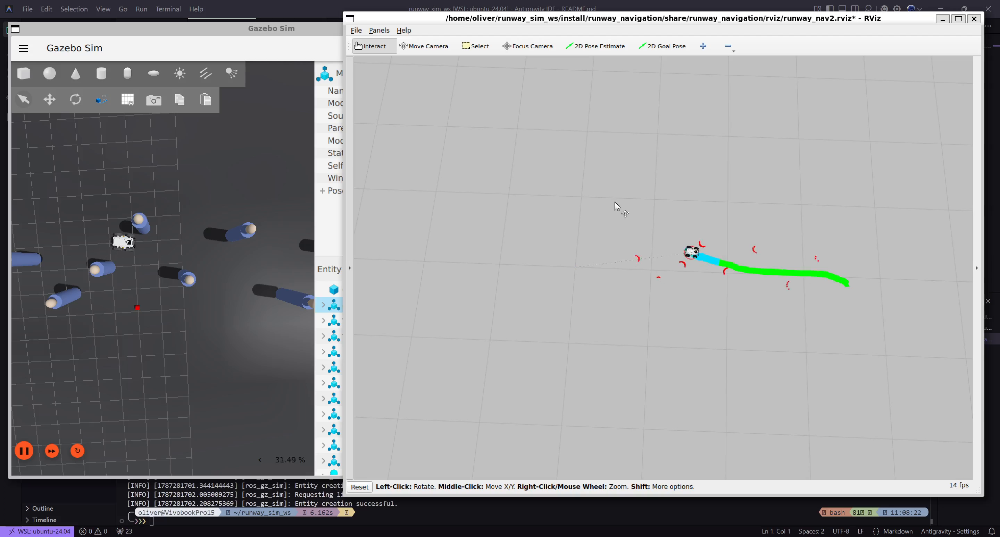

# 🛫 Autonomous Runway & Campus Inspection UGV Simulation System
### ROS 2 Jazzy Jalisco · Gazebo Harmonic · Nav2 (Hybrid A* + RPP) · RTK-GNSS + IMU Dual-EKF · AgileX Scout V2

<div align="center">
  
  <p><i>Autonomous AgileX Scout V2 UGV navigating via Nav2 Hybrid A* with centimeter-accurate RTK-GNSS + 9-DOF IMU Dual-EKF localization and 1.2m costmap safety inflation.</i></p>
</div>

---

## 🗂️ 1. File Tree & Repository Architecture

```text
runway_sim_ws/
├── assets/                          # Demonstration snapshots, recordings, and media
│   ├── simulation_demo.mp4          # HD simulation demo video
│   ├── simulation_demo.gif          # Simulation demo animated preview
│   ├── gazebo_runway_world.png      # Gazebo 3D simulation runway snapshot
│   ├── runway_ground_plane.png      # Airport runway surface terrain model
│   └── rviz_inspection_view.png     # RViz2 autonomous navigation snapshot
│
├── src/
│   ├── 📦 runway_description/       # Robot model, sensors, and 3D simulation worlds
│   │   ├── launch/
│   │   │   └── sim.launch.py        # Gazebo Harmonic launcher + ros_gz_bridge pipelines
│   │   ├── meshes/                  # Chassis base link, Hokuyo LiDAR, and wheel meshes (.dae)
│   │   ├── models/                  # Ground planes, airfield lighting, & person obstacle models
│   │   ├── urdf/
│   │   │   ├── scout_v2.xacro       # AgileX Scout V2 robot model & sensor definitions
│   │   │   └── ugv.urdf.xacro       # Top-level URDF robot description entry point
│   │   └── worlds/
│   │       ├── airport_runway.sdf   # 100m asphalt runway environment (Aarhus EKAH datum)
│   │       └── nus_ea_field.sdf     # NUS EA courtyard environment (Singapore datum)
│   │
│   ├── 🧭 runway_navigation/        # Nav2 navigation stack & sensor fusion configs
│   │   ├── config/
│   │   │   ├── ekf.yaml             # Dual-EKF + NavSat transform config (Airport Runway)
│   │   │   ├── ekf_nus.yaml         # Dual-EKF + NavSat transform config (NUS EA Field)
│   │   │   └── nav2_params.yaml     # Tuned Nav2 SmacPlannerHybrid & RPP parameters
│   │   ├── launch/
│   │   │   ├── bringup_nav2.launch.py     # Map server, Dual-EKF, Nav2, and RViz2 launcher
│   │   │   ├── runway_navigation_launch.py # Custom Nav2 lifecycle component launcher
│   │   │   └── sim_and_nav.launch.py      # All-in-one unified simulator & navigation launcher
│   │   ├── maps/
│   │   │   ├── runway_map.yaml/.pgm # 100m × 20m high-resolution runway occupancy grid
│   │   │   └── nus_ea_field.yaml/.pgm # High-resolution NUS EA courtyard occupancy grid
│   │   └── rviz/
│   │       └── runway_nav2.rviz     # Pre-configured RViz2 inspection interface
│   │
│   └── 📡 runway_communication/     # Inter-agent C2 telemetry, task ledger, and goal queue
│       ├── runway_communication/
│       │   ├── ugv_c2_bridge_node.py # C2 telemetry bridge, FIFO queue, & task state machine
│       │   ├── uav_waypoint_commander.py # Tactical radar HUD GUI & headless CLI node
│       │   └── DemoComs_C2.py       # Automated multi-target FOD alert transmitter script
│       └── package.xml
│
├── 🚁 rpi5_uav/                     # Standalone deployment package for Raspberry Pi 5
│   ├── uav_waypoint_commander.py    # Tactical GUI HUD & headless CLI
│   ├── DemoComs_C2.py               # Charan automated multi-target FOD alert dispatcher
│   ├── run_uav_gui.sh               # 1-Click launcher for 2D Tactical HUD GUI
│   ├── run_uav_demo.sh              # 1-Click launcher for Charan automated demo
│   ├── run_uav_headless.sh          # 1-Click launcher for Headless SSH CLI
│   ├── setup_dds.sh                 # CycloneDDS environment setup script
│   ├── cyclonedds.xml               # Unicast peer discovery configuration
│   └── README.md                    # Dedicated RPi 5 setup and operations guide
│
├── 💾 Backup/                       # Backup folder preserving previous documentation
│   ├── README_original.md           # Original repository README backup
│   ├── README_rpi5_original.md      # Original RPi 5 documentation backup
│   └── Phase1_ugvuav_communications.md # Phase 1 communications protocol backup
│
├── sync_to_repo.py                  # Automated workspace sync to external report repository
└── 📄 README.md                     # Master simulation documentation
```

---

## 🤖 2. What Has Been Simulated

The simulation models an industrial airport Ground Support Equipment (GSE) and runway patrol rover operating in Gazebo Harmonic with physical sensor bridges to ROS 2 Jazzy.

```
                      [ Gazebo Harmonic Simulation ]
               ┌───────────────────────┴───────────────────────┐
               ▼                                               ▼
      /imu/data (50 Hz)                               /gps/fix (10 Hz)
   [9-DOF Gyro & Accel]                           [Centimeter RTK NavSat]
               │                                               │
               │                                               ▼
               │                                    ┌──────────────────────┐
               │                                    │  navsat_transform    │
               │                                    │  (Datum WGS84 ->     │
               │                                    │   Local Cartesian)   │
               │                                    └──────────┬───────────┘
               │                                               │
               ├───────────────────┬───────────────┐           │ /odometry/gps
               │                   │               │           │
               ▼                   │               ▼           ▼
  ┌─────────────────────────┐      │     ┌────────────────────────────┐
  │  ekf_filter_node_odom   │      │     │    ekf_filter_node_map     │
  │  (Local Continuous EKF) │      │     │    (Global Absolute EKF)   │
  └────────────┬────────────┘      │     └─────────────┬──────────────┘
  Fuses /odom  │                   │     Fuses /odometry/local +
  + IMU ω_z    ▼                   │     /odometry/gps + IMU yaw
      Publishes TF:                │                   ▼
   odom -> base_footprint          │             Publishes TF:
   Topic: /odometry/local          └───────────>   map -> odom
```

### 1. Robot Platform & Physical Sensors
* **Chassis (AgileX Scout 2.0)**: 4WD skid-steer / differential-drive outdoor rover modeled in URDF/Xacro with authentic mass ($65\text{ kg}$), wheel inertias, suspension clearance, and realistic ground contact friction.
* **2D LiDAR (Hokuyo Laser Scanner)**: Mounted on the elevated mast (`lidar_link`), publishing `/scan` at 10 Hz with 360 laser beams and a $30.0\text{ m}$ range for real-time obstacle avoidance and dynamic costmap clearing.
* **RTK-GNSS GPS Receiver**: Simulated high-precision dual-frequency carrier-phase GNSS receiver (`gps_link`), publishing `/gps/fix` at 10 Hz with sub-centimeter position accuracy referenced to the Gazebo world spherical coordinates datum.
* **9-DOF IMU**: Solid-state inertial measurement unit (`imu_link`), publishing `/imu/data` at 50 Hz measuring high-rate angular velocity ($\omega_z$) and linear acceleration ($a_x, a_y$).
* **Forward Camera**: Optical color sensor mounted on the chassis (`camera_link`), publishing `/camera/image_raw` at 30 Hz ($640 \times 480$) for forward visual verification of Foreign Object Debris (FOD).

---

### 2. Dual-EKF Sensor Fusion Architecture

#### Why Raw Wheel Odometry Is NOT Enough
1. **Skid-Steer Tire Scrubbing**: The AgileX Scout 2.0 turns by running left and right wheels at differential speeds without a mechanical steering rack. During any turn, the tires physically scrub sideways across the ground. Wheel encoders assume pure rolling contact without slip, causing open-loop wheel odometry to accumulate severe heading and positional drift within seconds.
2. **Geometric Degeneracy on Runways (AMCL Failure)**: In an airport runway environment, there are no walls or vertical structures within 2D LiDAR range ($30\text{ m}$). Standard scan-matching and AMCL particle filters suffer from catastrophic geometric degeneracy (the featureless corridor problem) and cannot localize the robot.

#### How Dual-EKF Solves This Problem
To mirror real-world autonomous airport GSE, the system uses the industry-standard **Dual Extended Kalman Filter (`robot_localization`) + NavSat Transform** architecture:

1. **Local EKF (`ekf_filter_node_odom`)**:
   - **Inputs**: Wheel odometry linear velocities ($v_x, v_y$) + IMU angular rate ($\omega_z$).
   - **Function**: Ignores wheel encoder yaw rate and uses the drift-free IMU gyroscope to track orientation.
   - **Output**: Publishes smooth, continuous `odom -> base_footprint` transforms and `/odometry/local` at 30 Hz for the Nav2 controller.
2. **NavSat Transform Node (`navsat_transform`)**:
   - **Inputs**: Raw WGS-84 coordinates (`/gps/fix`) + IMU orientation (`/imu/data`).
   - **Function**: Projects spherical latitude/longitude fixes onto a local flat ENU Cartesian tangent plane referenced to the world origin datum (`use_local_cartesian: true`).
   - **Output**: Publishes Cartesian `/odometry/gps` in the `map` frame.
3. **Global EKF (`ekf_filter_node_map`)**:
   - **Inputs**: Local filtered odometry (`/odometry/local`) + RTK-GNSS Cartesian pose (`/odometry/gps`) + IMU absolute heading.
   - **Function**: Continuously corrects any long-term drift against ground truth.
   - **Output**: Publishes dynamic `map -> odom` transforms at 30 Hz, anchoring the robot to sub-centimeter truth ($< 4\text{ mm}$ measured error).

---

## 🧠 3. Autonomous Navigation Stack (Nav2)

<div align="center">
  <table>
    <tr>
      <th width="50%">Global Planner: SmacPlannerHybrid</th>
      <th width="50%">Local Controller: Regulated Pure Pursuit (RPP)</th>
    </tr>
    <tr>
      <td>
        <ul>
          <li><b>Kinematic Model:</b> Reeds-Shepp continuous curvature arcs</li>
          <li><b>Minimum Turning Radius:</b> $R \ge 1.0\text{ m}$</li>
          <li><b>Heuristic Table Size:</b> $10.0\text{ m}$ lookup radius</li>
          <li><b>Costmap Downsampling:</b> Factor of 2 optimization</li>
          <li><b>Eliminates:</b> Zero-radius in-place skid scrubbing</li>
        </ul>
      </td>
      <td>
        <ul>
          <li><b>Regulated Speed:</b> Curvature & obstacle slowdown</li>
          <li><b>Maximum Speed:</b> $10.0\text{ km/h}$ ($2.78\text{ m/s}$)</li>
          <li><b>Desired Patrol Speed:</b> $8.0\text{ km/h}$ ($2.22\text{ m/s}$)</li>
          <li><b>Lookahead Distance:</b> Dynamic $0.6\text{ m} \rightarrow 1.8\text{ m}$</li>
          <li><b>Rotate to Heading:</b> Enabled for initial alignment</li>
        </ul>
      </td>
    </tr>
  </table>
</div>

### 1. Global Planner: SmacPlannerHybrid vs Alternatives
* **Selected: `nav2_smac_planner::SmacPlannerHybrid` (Hybrid A*)**:
  - Plans kinematically feasible, continuous-curvature paths using Reeds-Shepp curves that respect the vehicle's minimum turning radius ($R \ge 1.0\text{ m}$).
  - Paths consist of smooth driving arcs that keep all 4 wheels rolling forward, preventing skid-steer scrubbing.
* **Why Alternatives Were Rejected**:
  - *NavFn / 2D Grid A* / Dijkstra*: Produce piecewise linear paths with sharp 90° corners. Following these paths forces a 4WD rover to execute abrupt zero-radius turns in place, violently scrubbing tires, shaking sensors, and destabilizing state estimation.
  - *SmacPlannerLattice / Theta**: High computational cost on large maps without guaranteeing continuous steering curvature.

### 2. Local Controller: Regulated Pure Pursuit vs Alternatives
* **Selected: `nav2_regulated_pure_pursuit_controller::RegulatedPurePursuitController` (RPP)**:
  - Dynamically regulates linear speed based on path curvature (slowing down entering sharp bends and accelerating on straightaways up to $10\text{ km/h}$).
  - Slows down when approaching proximity obstacles for heightened safety.
  - Exceptionally stable at high speeds ($2.22\text{ m/s}$ to $2.78\text{ m/s}$) with zero trajectory hunting.
* **Why Alternatives Were Rejected**:
  - *DWB (Dynamic Window Approach)*: Often suffers from trajectory oscillation and indecision in narrow walkways between obstacles.
  - *TEB (Timed Elastic Band)*: Computationally expensive on high-rate loops and prone to local minima flips when pedestrians pass nearby.

### 3. Nav2 Performance & Safety Configuration
* **Planner Heuristic Optimization**: In ultra-high-resolution maps ($0.028\text{ m/cell}$), default Hybrid A* configurations allocate over 36 million states, freezing initialization for over 35 seconds. By enabling `downsample_costmap: true` (factor 2) and setting `lookup_table_size: 10.0`, planner initialization drops from 35s down to **2.2 seconds**.
* **Safety Inflation Layer**: A **$1.20\text{ m}$ inflation radius** surrounds all obstacles and pedestrians with exponential cost decay. The robot maintains a generous safety buffer and will not clip corners or brush past airport ground personnel.

---

## 🚀 4. Step-by-Step Instructions to Run the Simulation

### 1. Prerequisites & Installation
Ensure you are running **Ubuntu 24.04 LTS** with **ROS 2 Jazzy Jalisco**:

```bash
# 1. Install ROS 2 Jazzy, Nav2, Gazebo Harmonic, and Robot Localization
sudo apt update
sudo apt install -y \
  ros-jazzy-navigation2 \
  ros-jazzy-nav2-bringup \
  ros-jazzy-nav2-smac-planner \
  ros-jazzy-robot-localization \
  ros-jazzy-ros-gz \
  ros-jazzy-tf2-tools \
  python3-colcon-common-extensions

# 2. Clone or download the workspace
cd ~
# If using git:
git clone <repository_url> runway_sim_ws
# If downloaded as a ZIP:
# unzip runway_sim_ws.zip -d ~/runway_sim_ws

# 3. Build the workspace
cd ~/runway_sim_ws
source /opt/ros/jazzy/setup.bash
colcon build --symlink-install
source install/setup.bash
```

---

### 2. Command Line to Launch Simulation & Navigation
Launch Gazebo Harmonic, the Dual-EKF localization pipeline, Nav2, and RViz2 together in a **single terminal window**:

#### For NUS EA Field (Campus Courtyard):
```bash
source /opt/ros/jazzy/setup.bash && source ~/runway_sim_ws/install/setup.bash
ros2 launch runway_navigation sim_and_nav.launch.py world_name:=nus_ea_field
```

#### For Aarhus Airport Runway (EKAH 100m Airfield):
```bash
source /opt/ros/jazzy/setup.bash && source ~/runway_sim_ws/install/setup.bash
ros2 launch runway_navigation sim_and_nav.launch.py world_name:=airport_runway
```

*(Gazebo Harmonic boots first, followed automatically after 3.5 seconds by Nav2 and RViz2. Press <kbd>Ctrl</kbd>+<kbd>C</kbd> in this terminal to shut down all processes cleanly together).*

---

### 3. Command Line to Spawn Obstacles (Near Starting Locations)
Open a **second terminal** to spawn human pedestrian obstacles directly in front of the robot to test real-time obstacle avoidance:

#### For NUS EA Field (Robot starts at $x = -25.0, y = 0.0$):
```bash
source /opt/ros/jazzy/setup.bash
ros2 run ros_gz_sim create -file ~/runway_sim_ws/src/runway_description/models/person/model.sdf -name person_start_1 -x -21.0 -y 1.2 -z 0.0 && \
ros2 run ros_gz_sim create -file ~/runway_sim_ws/src/runway_description/models/person/model.sdf -name person_start_2 -x -17.5 -y -1.5 -z 0.0 && \
ros2 run ros_gz_sim create -file ~/runway_sim_ws/src/runway_description/models/person/model.sdf -name person_start_3 -x -13.0 -y 0.5 -z 0.0
```

#### For Aarhus Airport Runway (Robot starts at $x = 0.0, y = 0.0$):
```bash
source /opt/ros/jazzy/setup.bash
ros2 run ros_gz_sim create -file ~/runway_sim_ws/src/runway_description/models/person/model.sdf -name person_runway_1 -x 6.0 -y 1.0 -z 0.0 && \
ros2 run ros_gz_sim create -file ~/runway_sim_ws/src/runway_description/models/person/model.sdf -name person_runway_2 -x 11.5 -y -1.2 -z 0.0 && \
ros2 run ros_gz_sim create -file ~/runway_sim_ws/src/runway_description/models/person/model.sdf -name person_runway_3 -x 18.0 -y 0.0 -z 0.0
```

---

### 4. How to Drive & Navigate the Robot in RViz2

<div align="center">
  
</div>

1. In the **RViz2 window**, look at the top toolbar and click the **`Nav2 Goal`** button (or press the <kbd>g</kbd> key on your keyboard).
2. Move your cursor to any walkway or runway location where you want the robot to go.
3. **Left-click and hold** at the destination point.
4. **Drag the green arrow** in the direction you want the robot to face when it arrives.
5. **Release the mouse button**.

> [!IMPORTANT]
> **No Manual "2D Pose Estimate" Required!**  
> Because the RTK-GNSS + IMU Dual-EKF continuously anchors the UGV to ground truth, you **never** need to manually estimate the robot's pose. Nav2 is ready to plan immediately upon startup.

---

## 🚁 5. Raspberry Pi 5 — UAV Tactical C2 Integration

For instructions on deploying the companion UAV Tactical Command & Control Station on a physical Raspberry Pi 5, connecting over the wireless datalink, and running the graphical radar HUD or automated multi-target alert demo:

👉 **[Read the Raspberry Pi 5 UAV Tactical Commander Guide](rpi5_uav/README.md)**

* **Run Interactive 2D Tactical HUD GUI**: `./run_uav_gui.sh` (or `python3 uav_waypoint_commander.py`)
* **Run Charan Automated FOD Alerts Demo**: `./run_uav_demo.sh` (or `python3 DemoComs_C2.py`)
* **Run Headless Terminal SSH CLI**: `./run_uav_headless.sh`
